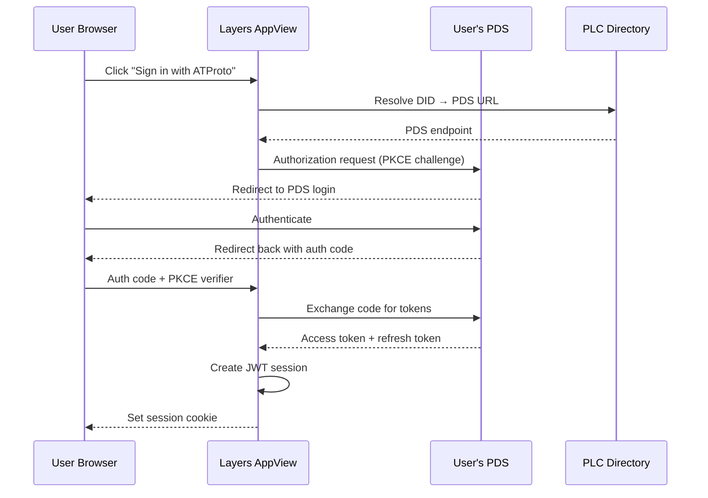

# Authentication and Authorization

## Auth Module Structure

The auth module is organized in `src/auth/`, matching Chive's directory layout:

```
src/auth/
├── atproto-oauth/     # OAuth client, session store, state store
├── authorization/     # Casbin service, model.conf, default-policy.csv
├── did/               # DID resolver, DID verifier, Redis cache
├── jwt/               # JWT service, key manager
├── mfa/               # MFA service (WebAuthn + TOTP)
├── scopes/            # Layers-specific scope definitions
├── service-auth/      # Service-to-service JWT verification (indexer↔API)
├── session/           # SessionManager, RefreshTokenManager
├── webauthn/          # WebAuthn credential registration and verification
└── zero-trust/        # Zero-trust policy enforcement (NIST SP 800-207)
```

## ATProto OAuth 2.0

The appview authenticates users via ATProto's OAuth 2.0 + PKCE flow, using `@atproto/oauth-client-node`. The user's DID (Decentralized Identifier) serves as their identity across the protocol.

### OAuth Flow



### DID Resolution

The appview resolves DIDs via the PLC Directory (default: `https://plc.directory`). DID documents contain the user's PDS endpoint URL and signing key. Resolution results are cached in Redis with a 1-hour TTL.

### Token Management

Access tokens from the PDS are short-lived. The appview uses `@atproto/oauth-client-node` to handle token refresh automatically. Session state (tokens, DID, handle) is encrypted with `SESSION_SECRET` and stored in Redis.

## JWT Sessions

After OAuth authentication, the appview issues its own JWT session token (via the `jose` library) that is sent as an HTTP-only cookie or `Authorization: Bearer` header.

| Field | Value |
|---|---|
| `sub` | User's DID (`did:plc:...`) |
| `handle` | User's ATProto handle |
| `iat` | Issued-at timestamp |
| `exp` | Expiration (default: 24 hours) |
| `iss` | AppView service DID |

Tokens are signed with `JWT_SECRET` (HS256). The `SessionManager` and `RefreshTokenManager` are separate classes in `src/auth/session/`, matching Chive's pattern. Session refresh extends the expiration without re-authenticating against the PDS.

## Service Authentication

For machine-to-machine communication (e.g., indexer↔API), the `ServiceAuthVerifier` in `src/auth/service-auth/` verifies JWTs issued by the calling service's DID. This matches Chive's service auth pattern:

```typescript
// Service auth JWT claims
{
  iss: "did:web:layers.pub:indexer",  // Calling service DID
  sub: "did:web:layers.pub",          // Target service DID
  aud: "https://layers.pub",
  exp: <timestamp>,
  lxm: "pub.layers.expression.*",    // Lexicon method scope
  iat: <timestamp>
}
```

## Layers-Specific Scopes

Scopes control fine-grained API access, defined in `src/auth/scopes/`:

| Scope | Description |
|-------|-------------|
| `read:records` | Read all public records |
| `write:expression` | Create/update expressions |
| `write:annotation` | Create/update annotation layers |
| `write:corpus` | Create/manage corpora and memberships |
| `write:ontology` | Create/manage ontologies and type definitions |
| `write:experiment` | Create/manage experiment definitions |
| `admin:dlq` | View and replay dead letter queue entries |
| `admin:users` | Manage user roles and permissions |

## Authorization Model

### Casbin RBAC

The appview uses [Casbin](https://casbin.org/) for role-based access control. Policies are defined in a model file and loaded at startup.

**Policy Model:**

```ini
[request_definition]
r = sub, obj, act

[policy_definition]
p = sub, obj, act

[role_definition]
g = _, _

[policy_effect]
e = some(where (p.eft == allow))

[matchers]
m = g(r.sub, p.sub) && r.obj == p.obj && r.act == p.act
```

### Role Definitions

| Role | Description | Permissions |
|---|---|---|
| `reader` | Default for all authenticated users | Read all public records, search, browse |
| `annotator` | Can create annotation data | Reader + create expressions, segmentations, annotation layers, alignments |
| `corpus_manager` | Can organize corpora | Annotator + create/manage corpora, memberships, ontologies |
| `experimenter` | Can run judgment experiments | Annotator + create experiment definitions, templates, fillings |
| `administrator` | Full access | All operations including user management and system configuration |

### Policy Rules

```csv
p, reader, records, read
p, annotator, expression, create
p, annotator, segmentation, create
p, annotator, annotationLayer, create
p, annotator, alignment, create
p, annotator, graphEdge, create
p, annotator, persona, create
p, corpus_manager, corpus, create
p, corpus_manager, membership, create
p, corpus_manager, ontology, create
p, corpus_manager, typeDef, create
p, experimenter, experimentDef, create
p, experimenter, template, create
p, experimenter, filling, create
p, experimenter, judgmentSet, create
p, administrator, *, *
g, annotator, reader
g, corpus_manager, annotator
g, experimenter, annotator
g, administrator, corpus_manager
g, administrator, experimenter
```

Role inheritance: `administrator` inherits from `corpus_manager` and `experimenter`, which both inherit from `annotator`, which inherits from `reader`.

### Per-Corpus Permissions

Beyond global roles, corpus owners can grant per-corpus permissions. A corpus owner can designate specific DIDs as annotators or adjudicators for their corpus. These permissions are stored in the `corpus.corpus` record's `annotationDesign` field and enforced at the API layer.

## Multi-Factor Authentication

### WebAuthn/FIDO2

The appview supports hardware security keys and biometric authentication via `@simplewebauthn/server`. Users can register one or more WebAuthn credentials and use them as a second factor during login.

### TOTP

Time-based one-time passwords are supported via `@otplib`. Users scan a QR code in their authenticator app and enter 6-digit codes during login.

MFA is optional by default and can be enforced per-role by the administrator.

## Zero-Trust Architecture

Following Chive's zero-trust model and NIST SP 800-207, the appview enforces:

- **Every request authenticated**: No implicit access; defaults to deny. Anonymous users have read-only access to public records with strict rate limiting.
- **mTLS between services**: The API server and firehose indexer communicate over mutual TLS in production. Database connections use TLS with certificate verification.
- **Trust scoring**: The `ZeroTrustService` in `src/auth/zero-trust/` computes a trust score for each request based on authentication strength (password vs. passkey vs. service auth), DID verification freshness, and request context.
- **Audit logging**: All authentication and authorization events are logged with tamper-resistant structured entries for compliance.
- **Redis-backed authorization cache**: Role assignments are cached in Redis sorted sets for sub-millisecond RBAC lookups, matching Chive's `AuthorizationService`.

## Security Considerations

### Rate Limiting

See [API Design](./api-design) for the 4-tier rate limiting model with sliding window sorted-set algorithm.

### Input Validation

All user input is validated through Zod schemas before reaching any database. AT-URIs, DIDs, and other protocol identifiers are validated against their format specifications.

### CORS

The appview allows cross-origin requests only from configured origins. The default configuration permits requests from the Layers web frontend domain.

### Secrets Management

| Secret | Storage |
|---|---|
| `JWT_SECRET` | Environment variable (dev), External Secrets Operator (production) |
| `SESSION_SECRET` | Environment variable (dev), External Secrets Operator (production) |
| `OAUTH_CLIENT_SECRET` | Environment variable (dev), External Secrets Operator (production) |
| Database credentials | Environment variable (dev), External Secrets Operator (production) |

No secrets are stored in code or version control. Production deployments use the [External Secrets Operator](https://external-secrets.io/) to inject secrets from a vault (e.g., HashiCorp Vault, AWS Secrets Manager) into Kubernetes pods. Secrets are refreshed on a 1-hour interval.

## Future Considerations

- **Passkeys-first**: The industry is shifting toward passkeys as the primary authentication method (FIDO Alliance 2025 adoption milestones). The appview already supports WebAuthn and can transition to passkeys-first when adoption reaches critical mass.
- **DPoP tokens**: The emerging [DPoP](https://datatracker.ietf.org/doc/html/rfc9449) (Demonstrating Proof of Possession) standard binds tokens to specific clients, preventing token theft/replay. Monitor ATProto ecosystem adoption.

## See Also

- [API Design](./api-design) for how authentication middleware integrates with endpoints
- [Deployment](./deployment) for production secrets management
- [Technology Stack](./technology-stack) for library versions
