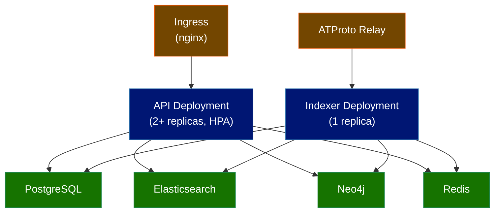

# Deployment and Infrastructure

## Container Strategy

### Docker Multi-Stage Build

The appview uses a multi-stage Dockerfile with a **distroless runtime image** for minimal attack surface:

```dockerfile
# Stage 1: Dependencies
FROM node:22-alpine AS deps
WORKDIR /app
RUN corepack enable pnpm
COPY pnpm-lock.yaml pnpm-workspace.yaml package.json ./
RUN pnpm install --frozen-lockfile

# Stage 2: Build
FROM node:22-alpine AS builder
WORKDIR /app
COPY --from=deps /app/node_modules ./node_modules
COPY . .
RUN pnpm build
RUN pnpm prune --prod

# Stage 3: Runtime (distroless — no shell, no package manager)
FROM gcr.io/distroless/nodejs22-debian12
WORKDIR /app
USER 1001
COPY --from=builder /app/dist ./dist
COPY --from=builder /app/node_modules ./node_modules
COPY --from=builder /app/package.json ./
EXPOSE 3000
CMD ["dist/index.js"]
```

The final image runs as a non-root user (UID 1001) with no build tools, dev dependencies, or source code. Images are signed with **Sigstore cosign** in CI for supply chain verification.

### Docker Compose Files

Multiple compose files match Chive's `docker/` directory pattern:

| File | Purpose |
|------|---------|
| `docker/docker-compose.yml` | Development: PG, Redis, ES, Neo4j |
| `docker/docker-compose.prod.yml` | Production: full stack with resource limits |
| `docker/docker-compose.ci.yml` | CI testing: lightweight containers |
| `docker/docker-compose.observability.yml` | Grafana, Tempo, Prometheus, OTEL Collector |

Supporting configs: `docker/otel-collector-config.yaml`, `docker/prometheus.yml`.

### Image Variants

| Image | Entry Point | Purpose |
|---|---|---|
| `layers-appview:api` | `dist/index.js` | API server (XRPC + REST) |
| `layers-appview:indexer` | `dist/indexer.js` | Firehose consumer + job queue workers |

Both images share the same base build; only the `CMD` differs. This keeps the container registry simple while allowing independent scaling.

## Kubernetes Architecture

### Deployment Topology



**API Deployment**: Multiple replicas behind an ingress controller. Stateless; scales horizontally via HPA.

**Indexer Deployment**: Single replica. The firehose consumer must be single-instance to maintain cursor ordering. If the pod crashes, Kubernetes restarts it and it resumes from the persisted cursor. Workers within the indexer can run with higher concurrency but must coordinate through BullMQ's locking.

### Horizontal Pod Autoscaling

```yaml
apiVersion: autoscaling/v2
kind: HorizontalPodAutoscaler
metadata:
  name: layers-api-hpa
spec:
  scaleTargetRef:
    apiVersion: apps/v1
    kind: Deployment
    name: layers-api
  minReplicas: 2
  maxReplicas: 10
  metrics:
    - type: Resource
      resource:
        name: cpu
        target:
          type: Utilization
          averageUtilization: 70
    - type: Resource
      resource:
        name: memory
        target:
          type: Utilization
          averageUtilization: 80
```

### Resource Requests and Limits

| Deployment | CPU Request | CPU Limit | Memory Request | Memory Limit |
|---|---|---|---|---|
| API | 200m | 1000m | 256Mi | 1Gi |
| Indexer | 500m | 2000m | 512Mi | 2Gi |

The indexer has higher resource allocation because it handles firehose parsing, record validation, and multi-database writes concurrently.

### Pod Disruption Budget

```yaml
apiVersion: policy/v1
kind: PodDisruptionBudget
metadata:
  name: layers-api-pdb
spec:
  minAvailable: 1
  selector:
    matchLabels:
      app: layers-api
```

### Health Probes

```yaml
livenessProbe:
  httpGet:
    path: /health
    port: 3000
  initialDelaySeconds: 10
  periodSeconds: 15
readinessProbe:
  httpGet:
    path: /ready
    port: 3000
  initialDelaySeconds: 5
  periodSeconds: 10
```

## Kustomize Overlays

The Kubernetes manifests are organized with Kustomize, with additional directories matching Chive's `k8s/` structure:

```
k8s/
├── base/
│   ├── appview/              # API deployment, service, HPA, PDB
│   ├── indexer/              # Indexer deployment
│   ├── rbac/                 # ServiceAccounts, Roles, RoleBindings
│   ├── ingress/              # Ingress with cert-manager annotations
│   └── kustomization.yaml
├── overlays/
│   ├── dev/                  # Lower resources, single replica
│   ├── staging/              # Production-like, staging secrets
│   └── prod/                 # Full resources, external secrets
├── helm/                     # Optional Helm chart for templated deployment
│   └── layers-appview/
├── monitoring/               # ServiceMonitors, Prometheus rules, Grafana dashboards
├── disaster-recovery/        # Backup CronJobs (PG, ES, Neo4j)
├── secrets/                  # ExternalSecret definitions
└── gitops/                   # ArgoCD Application or Flux Kustomization manifests
```

Each overlay patches resource limits, replica counts, environment variables, and secret references for its target environment.

### GitOps Deployment

Production deployments use **ArgoCD** or **Flux** for GitOps-based continuous delivery, replacing manual `kubectl apply`:

```yaml
# k8s/gitops/argocd-application.yaml
apiVersion: argoproj.io/v1alpha1
kind: Application
metadata:
  name: layers-appview
spec:
  source:
    repoURL: https://github.com/layers-pub/layers
    path: k8s/overlays/prod
  destination:
    server: https://kubernetes.default.svc
    namespace: layers
  syncPolicy:
    automated:
      prune: true
      selfHeal: true
```

## Database Deployment

| Database | Recommended Approach | Notes |
|---|---|---|
| PostgreSQL 16+ | Managed service (e.g., AWS RDS, GCP Cloud SQL) or operator (CloudNativePG) | Enable WAL archiving for point-in-time recovery |
| Elasticsearch 8+ | Managed service (Elastic Cloud) or operator (ECK) | Minimum 3-node cluster for production |
| Neo4j 5+ | Managed service (Neo4j Aura) or Helm chart | Single instance sufficient for moderate workloads |
| Redis 7+ | Managed service (ElastiCache, Memorystore) or Helm chart (Bitnami) | Sentinel or Cluster mode for HA |

For development, all four databases run as containers via Docker Compose.

## Secrets Management

Production deployments use the [External Secrets Operator](https://external-secrets.io/) to synchronize secrets from a vault into Kubernetes secrets:

```yaml
apiVersion: external-secrets.io/v1beta1
kind: ExternalSecret
metadata:
  name: layers-secrets
spec:
  refreshInterval: 1h
  secretStoreRef:
    name: vault-backend
    kind: ClusterSecretStore
  target:
    name: layers-secrets
  data:
    - secretKey: JWT_SECRET
      remoteRef:
        key: layers/production/jwt-secret
    - secretKey: DATABASE_URL
      remoteRef:
        key: layers/production/database-url
```

## TLS

TLS termination is handled at the ingress controller (nginx-ingress) with certificates provisioned by cert-manager and Let's Encrypt.

## CI/CD Pipeline

### Build Pipeline

1. **Lint**: ESLint + Prettier check
2. **Type check**: `tsc --noEmit`
3. **Unit tests**: Vitest (`vitest.unit.config.ts`)
4. **Build**: TypeScript compilation + Docker image build
5. **Push**: Push image to container registry with git SHA tag
6. **Sign**: Sign image with **Sigstore cosign** (keyless) for supply chain verification

### Test Pipeline

1. **Integration tests**: Vitest with Testcontainers (PG, ES, Neo4j, Redis) (`vitest.config.ts`)
2. **Compliance tests**: Lexicon schema validation for all 26 record types (`vitest.compliance.config.ts`)
3. **E2E tests**: Playwright against a staging environment
4. **Performance tests**: k6 load scenarios (release-only)

### Deploy Pipeline

1. **Staging**: Automatic deploy via GitOps (ArgoCD/Flux) on merge to `main`
2. **Pre-deployment tests**: Health checks against staging (`vitest.pre-deployment.config.ts`)
3. **Production**: Manual promotion from staging (approval gate)
4. **Rollback**: Redeploy previous image tag via Kubernetes rollout or GitOps revert

## Backup and Recovery

### PostgreSQL

- **Continuous WAL archiving** to object storage (S3, GCS)
- **Daily base backups** via `pg_basebackup`
- **Point-in-time recovery** using WAL replay
- **Retention**: 30 days of backups

### Elasticsearch

- **Snapshot lifecycle management** to object storage
- **Daily snapshots** with 14-day retention
- Can be fully rebuilt from PostgreSQL if snapshots are lost

### Neo4j

- **Online backups** via `neo4j-admin dump`
- **Daily** with 14-day retention
- Can be fully rebuilt from PostgreSQL if backups are lost

### Disaster Recovery

Since all appview data is derived from the ATProto firehose, the ultimate disaster recovery strategy is a full re-index from cursor 0. This is slower than restoring from backups but guarantees complete data integrity.

| Recovery Method | RTO | RPO |
|---|---|---|
| PG point-in-time recovery | Minutes | Seconds (WAL lag) |
| Snapshot restore (ES, Neo4j) | 30 min | 24 hours (daily snapshots) |
| Full re-index from firehose | Hours | Zero (complete rebuild) |

## See Also

- [Technology Stack](./technology-stack) for Docker, Kubernetes, and infrastructure tool versions
- [Observability](./observability) for health check endpoints and monitoring
- [Testing Strategy](./testing-strategy) for CI/CD test configuration
