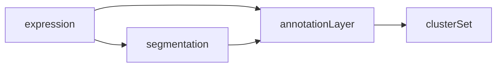
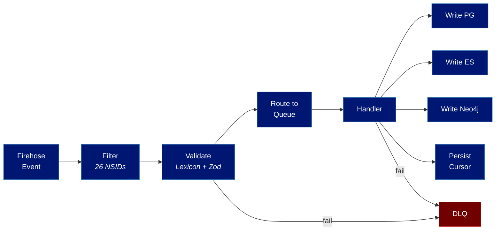
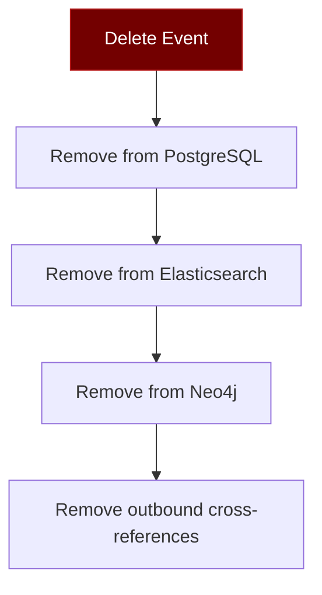

# Firehose Ingestion Pipeline

The firehose ingestion pipeline is the entry point for all `pub.layers.*` data into the appview. It subscribes to the ATProto relay's event stream, filters for Layers-relevant commits, validates records against their Lexicon schemas, and routes them through a dependency-aware job queue into PostgreSQL, Elasticsearch, and Neo4j.

## ATProto Firehose Overview

The AT Protocol relay aggregates repository events from every PDS in the network and broadcasts them over a single WebSocket stream. The appview subscribes to this stream using the `com.atproto.sync.subscribeRepos` XRPC method. Every event on the firehose falls into one of four categories:

- **Commit events**: repository mutations (create, update, delete) containing CAR-encoded blocks with the actual record data
- **Handle events**: DID-to-handle mapping changes
- **Identity events**: DID document updates (e.g., key rotation, PDS migration)
- **Account events**: account status changes (activation, deactivation, suspension)

Each event carries a monotonically increasing **sequence number** (cursor). The appview persists this cursor so it can resume from where it left off after a restart, without reprocessing the entire history.

Commit events are the primary interest of the Layers appview. Each commit contains one or more **operations** (creates, updates, or deletes) on records within a user's repository. The operations include the collection NSID, the record key (rkey), and (for creates and updates) the record value encoded as a DAG-CBOR block within a CAR file.

## Subscription Management

### Connection

The firehose consumer establishes a WebSocket connection to the relay at `wss://bsky.network` (configurable via `LAYERS_RELAY_URL`). The subscription request includes the last persisted cursor as a query parameter:

```
wss://bsky.network/xrpc/com.atproto.sync.subscribeRepos?cursor=12345678
```

If no cursor is persisted (first run or full rebuild), the consumer starts from cursor `0` to replay the entire history.

### Cursor Persistence

The current cursor is persisted to the `firehose_cursor` table in PostgreSQL. To avoid excessive write amplification, the cursor is flushed periodically (every 1000 events or every 5 seconds, whichever comes first) rather than on every event. On unclean shutdown, at most a few seconds of events are reprocessed. This is safe because all handlers are idempotent.

```sql
-- See Database Design for full schema
CREATE TABLE firehose_cursor (
  id         INTEGER PRIMARY KEY DEFAULT 1 CHECK (id = 1),
  cursor     BIGINT NOT NULL,
  updated_at TIMESTAMPTZ NOT NULL DEFAULT NOW()
);
```

### Reconnection

Connection drops are expected and handled automatically. The consumer uses a [cockatiel](https://github.com/connor-peet/cockatiel) circuit breaker with the following parameters:

| Parameter | Value | Rationale |
|---|---|---|
| Initial delay | 500ms | Fast retry for transient network blips |
| Max delay | 30s | Cap to avoid long outages |
| Backoff multiplier | 2x | Exponential growth |
| Jitter | +/-25% | Prevent thundering herd across replicas |
| Half-open after | 60s | Probe relay availability |

### Backpressure

If the BullMQ job queue depth exceeds a configurable threshold (default: 10,000 pending jobs), the consumer **pauses** the WebSocket connection. The relay buffers events for a limited window; if the pause exceeds the relay's buffer, the consumer reconnects and resumes from its last persisted cursor. This prevents unbounded memory growth during downstream slowdowns.

## Event Filtering

The vast majority of firehose events are irrelevant to the Layers appview (Bluesky posts, likes, follows, etc.). The filter stage inspects each commit's operations and extracts only those touching one of the 26 `pub.layers.*` collection NSIDs:

| # | Collection NSID |
|---|---|
| 1 | `pub.layers.expression.expression` |
| 2 | `pub.layers.segmentation.segmentation` |
| 3 | `pub.layers.annotation.annotationLayer` |
| 4 | `pub.layers.annotation.clusterSet` |
| 5 | `pub.layers.ontology.ontology` |
| 6 | `pub.layers.ontology.typeDef` |
| 7 | `pub.layers.corpus.corpus` |
| 8 | `pub.layers.corpus.membership` |
| 9 | `pub.layers.resource.entry` |
| 10 | `pub.layers.resource.collection` |
| 11 | `pub.layers.resource.collectionMembership` |
| 12 | `pub.layers.resource.template` |
| 13 | `pub.layers.resource.filling` |
| 14 | `pub.layers.resource.templateComposition` |
| 15 | `pub.layers.judgment.experimentDef` |
| 16 | `pub.layers.judgment.judgmentSet` |
| 17 | `pub.layers.judgment.agreementReport` |
| 18 | `pub.layers.alignment.alignment` |
| 19 | `pub.layers.graph.graphNode` |
| 20 | `pub.layers.graph.graphEdge` |
| 21 | `pub.layers.graph.graphEdgeSet` |
| 22 | `pub.layers.persona.persona` |
| 23 | `pub.layers.media.media` |
| 24 | `pub.layers.eprint.eprint` |
| 25 | `pub.layers.eprint.dataLink` |
| 26 | `pub.layers.changelog.entry` |

The filter is implemented as a `Set<string>` lookup on the operation's collection field. Non-matching operations are discarded with zero allocation overhead. Matching operations are decoded from DAG-CBOR and passed to the validation stage.

## Record Validation

Every extracted record passes through two validation layers before entering the job queue.

### Lexicon Schema Validation

The record is validated against its Lexicon JSON schema using `@atproto/lexicon`. This ensures structural correctness: required fields are present, types match, string formats (AT-URI, DID, datetime) are well-formed, and union discriminators resolve to known variants. Records that fail Lexicon validation are **rejected immediately** because they represent protocol-level corruption or a version mismatch.

### Business Rule Validation (Zod)

Records that pass Lexicon validation are then checked against stricter Zod schemas that encode Layers-specific business rules:

- Annotation spans must have `start < end`
- Segmentation token offsets must be monotonically increasing and within the expression's text length
- Ontology `typeDef` records must reference an existing `ontology` AT-URI
- Graph edges must reference valid `graphNode` AT-URIs
- Enum values must belong to their declared flexible enum domains

### Dead Letter Queue

Records that fail either validation stage are routed to the Dead Letter Queue (DLQ) with structured error metadata:

```typescript
interface DLQEntry {
  id: string;
  collection: string;
  rkey: string;
  did: string;
  error: {
    stage: 'lexicon' | 'zod';
    message: string;
    path?: string[];        // JSON path to the failing field
    expected?: string;
    received?: string;
  };
  rawRecord: unknown;       // Original record for debugging
  firehoseCursor: number;
  timestamp: Date;
}
```

DLQ entries are stored in PostgreSQL and exposed through an admin API for inspection and replay. See [Background Jobs](./background-jobs) for DLQ monitoring and reprocessing.

## Job Queue Architecture

Validated records are dispatched to BullMQ queues organized by namespace. Each queue can be scaled independently by adjusting its worker concurrency.

### Queue Topology

| Queue | Records | Priority | Notes |
|---|---|---|---|
| `layers:expression` | `expression` | HIGH | Must process before annotation/segmentation |
| `layers:segmentation` | `segmentation` | HIGH | Must process before annotation |
| `layers:annotation` | `annotationLayer`, `clusterSet` | HIGH | Core pipeline; depends on expression + segmentation |
| `layers:ontology` | `ontology`, `typeDef` | MEDIUM | Independent |
| `layers:corpus` | `corpus`, `membership` | MEDIUM | Independent |
| `layers:resource` | `entry`, `collection`, `collectionMembership`, `template`, `filling`, `templateComposition` | MEDIUM | Independent |
| `layers:judgment` | `experimentDef`, `judgmentSet`, `agreementReport` | MEDIUM | Independent |
| `layers:alignment` | `alignment` | MEDIUM | Independent |
| `layers:graph` | `graphNode`, `graphEdge`, `graphEdgeSet` | MEDIUM | Independent |
| `layers:integration` | `persona`, `media`, `eprint`, `dataLink` | LOW | Supporting records |

### Dependency-Aware Processing

The core pipeline records (expression, segmentation, and annotation) have strict processing order dependencies:



An `annotationLayer` references both an `expression` (via `sourceUrl`) and a `segmentation` (via `segSourceUrl`). If an annotation arrives on the firehose before its expression, the handler cannot resolve the cross-reference or validate span offsets.

The dependency resolution strategy:

1. **Check existence**: The annotation handler queries PostgreSQL for the referenced expression and segmentation.
2. **If present**: Proceed with normal indexing.
3. **If missing**: Re-queue the job with an exponential delay (`1s`, `4s`, `16s`) using BullMQ's built-in delay mechanism.
4. **After 3 retries**: Move to the DLQ. The missing dependency likely indicates a data integrity issue (deleted expression, malformed AT-URI) rather than a timing issue.

This pattern applies to any record type that references another Layers record. The `layers:expression` and `layers:segmentation` queues are processed at HIGH priority to minimize the window during which dependent records are waiting.

## Indexing Pipeline

The full path from firehose event to indexed record:



### Per-Record-Type Handlers

Each record type has a dedicated handler that knows how to extract fields for PostgreSQL columns, construct Elasticsearch documents, and create Neo4j nodes and edges. Handlers implement a common interface:

```typescript
interface RecordHandler<T> {
  /** The collection NSID this handler processes */
  collection: string;

  /** Extract PG row data from the record */
  toPgRow(did: string, rkey: string, record: T): PgRowData;

  /** Construct ES document (return null if this type is not indexed in ES) */
  toEsDocument(did: string, rkey: string, record: T): EsDocument | null;

  /** Create Neo4j operations (return empty array if not indexed in Neo4j) */
  toNeo4jOps(did: string, rkey: string, record: T): Neo4jOperation[];

  /** Extract cross-references from this record */
  extractRefs(did: string, rkey: string, record: T): CrossReference[];
}
```

### Example: Expression Handler

```typescript
const expressionHandler: RecordHandler<Expression> = {
  collection: 'pub.layers.expression.expression',

  toPgRow(did, rkey, record) {
    return {
      table: 'expressions',
      data: {
        uri: `at://${did}/pub.layers.expression.expression/${rkey}`,
        did,
        rkey,
        text: record.text,
        lang: record.lang,
        media_type: record.mediaType ?? 'text/plain',
        source_url: record.sourceUrl ?? null,
        context_url: record.contextUrl ?? null,
        created_at: record.createdAt,
        indexed_at: new Date(),
      },
    };
  },

  toEsDocument(did, rkey, record) {
    return {
      index: 'layers_expressions',
      id: `at://${did}/pub.layers.expression.expression/${rkey}`,
      body: {
        uri: `at://${did}/pub.layers.expression.expression/${rkey}`,
        did,
        text: record.text,
        lang: record.lang,
        media_type: record.mediaType ?? 'text/plain',
        created_at: record.createdAt,
      },
    };
  },

  toNeo4jOps(did, rkey, record) {
    const uri = `at://${did}/pub.layers.expression.expression/${rkey}`;
    const ops: Neo4jOperation[] = [
      {
        type: 'MERGE_NODE',
        label: 'Expression',
        properties: { uri, did, lang: record.lang },
      },
    ];

    // If the expression references a source (e.g., a media record), create an edge
    if (record.sourceUrl) {
      ops.push({
        type: 'MERGE_EDGE',
        from: uri,
        to: record.sourceUrl,
        label: 'HAS_SOURCE',
      });
    }

    return ops;
  },

  extractRefs(did, rkey, record) {
    const uri = `at://${did}/pub.layers.expression.expression/${rkey}`;
    const refs: CrossReference[] = [];

    if (record.sourceUrl) {
      refs.push({ fromUri: uri, toUri: record.sourceUrl, refType: 'sourceUrl' });
    }
    if (record.contextUrl) {
      refs.push({ fromUri: uri, toUri: record.contextUrl, refType: 'contextUrl' });
    }

    return refs;
  },
};
```

All three writes (PG, ES, Neo4j) execute within a single handler invocation. PG is the source of truth and is written first inside a transaction. ES and Neo4j writes are best-effort; if either fails, the job is retried. See [Database Design](./database-design) for the full schema definitions and [Background Jobs](./background-jobs) for retry and consistency reconciliation.

## Cross-Reference Resolution

Layers records form a dense web of AT-URI references. The ingestion pipeline extracts every reference and writes it to the `cross_references` table, enabling efficient "find everything referencing this record" queries.

### Forward References

When a record is indexed, all AT-URI reference fields are extracted by the handler's `extractRefs` method and inserted into `cross_references`:

```sql
INSERT INTO cross_references (from_uri, to_uri, ref_type, created_at)
VALUES ($1, $2, $3, NOW())
ON CONFLICT (from_uri, to_uri, ref_type) DO NOTHING;
```

This happens during the initial indexing pass. No additional processing is needed.

### Back-References

When a new expression arrives, the pipeline checks whether any already-indexed records hold forward references to it that could not be fully resolved at index time. For example:

1. An `annotationLayer` arrives referencing expression `at://did:plc:abc/pub.layers.expression.expression/xyz`.
2. The expression does not yet exist in PG. The annotation job is re-queued (see [Dependency-Aware Processing](#dependency-aware-processing)).
3. Later, the expression arrives and is indexed.
4. After indexing the expression, the handler queries `cross_references` for any `to_uri` matching the new expression's AT-URI and re-enqueues the corresponding records for processing.

This ensures that late-arriving dependencies are eventually resolved without manual intervention.

## Deletion and Tombstone Handling

When a delete operation arrives on the firehose, the pipeline removes the record from all three storage backends.

### Deletion Sequence



1. **PostgreSQL**: Delete the row from the record's table. This cascades to any PG-level foreign keys (e.g., normalized annotation rows for an `annotationLayer`).
2. **Elasticsearch**: Delete the document by its AT-URI ID.
3. **Neo4j**: Delete the node and all edges originating from it.
4. **Cross-references**: Delete all rows in `cross_references` where `from_uri` matches the deleted record.

### Dangling Reference Policy

Cross-references that point **to** the deleted record are intentionally **not** removed. Records that referenced the now-deleted record retain their dangling `to_uri` references. This is consistent with ATProto's eventual consistency model: a user may delete a record that others reference, and those references become stale rather than cascading deletions across repository boundaries.

Query endpoints handle dangling references gracefully by returning `null` for unresolvable AT-URIs and flagging them in the response.

## Firehose Lag Monitoring

Firehose lag (the delay between when an event is produced by the relay and when the appview processes it) is the primary health indicator for the ingestion pipeline.

### Metrics

| Metric | Type | Labels | Description |
|---|---|---|---|
| `layers_firehose_cursor_lag_seconds` | Gauge | | Wall-clock time minus the timestamp of the last processed event |
| `layers_firehose_events_processed_total` | Counter | `collection` | Total events processed, broken down by collection NSID |
| `layers_firehose_events_filtered_total` | Counter | | Total events discarded by the filter stage |
| `layers_firehose_validation_failures_total` | Counter | `stage`, `collection` | Validation failures by stage (lexicon/zod) and collection |
| `layers_firehose_queue_depth` | Gauge | `queue` | Current pending job count per BullMQ queue |

### Alert Thresholds

| Condition | Severity | Action |
|---|---|---|
| `cursor_lag_seconds > 60` | Warning | Page on-call; check queue depth and worker health |
| `cursor_lag_seconds > 300` | Critical | Immediate investigation; likely downstream outage or backpressure |
| `queue_depth > 10000` (any queue) | Warning | Scale workers or investigate slow handler |
| `validation_failures_total` spike | Warning | Check for Lexicon version mismatch or malformed PDS |

### Dashboard

The Grafana dashboard includes the following panels for firehose health:

- **Cursor lag**: Real-time gauge and time-series graph of `layers_firehose_cursor_lag_seconds`
- **Throughput**: Events per second, stacked by collection
- **Queue depth**: Per-queue pending job counts
- **DLQ inflow**: Rate of records entering the dead letter queue
- **Validation failure rate**: Failures per second by stage and collection

See [Observability](./observability) for the full dashboard and alerting configuration.

## See Also

- [Database Design](./database-design) for PostgreSQL schema, Elasticsearch mappings, and Neo4j graph model
- [Background Jobs](./background-jobs) for worker configuration, concurrency tuning, and DLQ management
- [Indexing Strategy](./indexing-strategy) for per-record-type indexing decisions and annotation normalization
- [Technology Stack](./technology-stack) for version pins on BullMQ, Redis, cockatiel, and other dependencies
