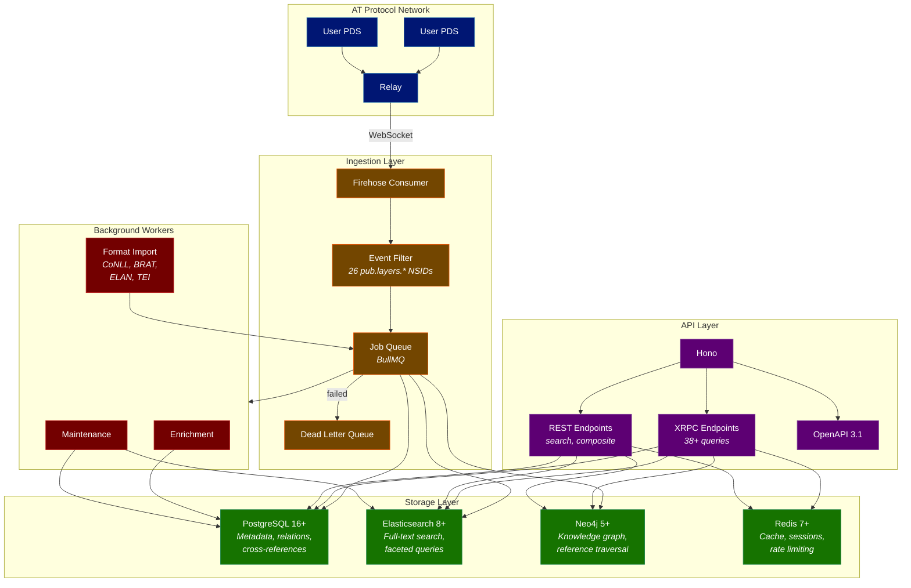

# AppView Plans

## What is the Layers AppView?

An ATProto **appview** is a read-only indexing service that subscribes to the protocol's firehose, extracts records it cares about, and serves them back through query endpoints. The appview never owns user data; all `pub.layers.*` records live in user-controlled Personal Data Servers (PDSes). If the appview's database disappears, nothing is lost because every record can be rebuilt from the firehose.

The Layers appview indexes all 26 `pub.layers.*` record types, maintains full-text and faceted search indexes, builds a knowledge graph from cross-references, and exposes the results through XRPC and REST APIs.

## Architecture at a Glance

## Record Type Coverage Matrix

Every `pub.layers.*` record type is indexed into one or more storage backends. PostgreSQL is the source of truth for all types. Elasticsearch and Neo4j are populated selectively based on query requirements.

| Record Type | PG | ES | Neo4j | Notes |
|---|---|---|---|---|
| `expression.expression` | yes | yes | yes | Full-text search on `text`, graph node for cross-refs |
| `segmentation.segmentation` | yes | — | — | Token arrays stored in PG, queried via expression |
| `annotation.annotationLayer` | yes | yes | yes | Annotations normalized to rows in PG, nested in ES for faceted search, per-annotation nodes in Neo4j |
| `annotation.clusterSet` | yes | — | yes | Cluster membership edges in Neo4j |
| `ontology.ontology` | yes | yes | — | Searchable by domain and name |
| `ontology.typeDef` | yes | yes | yes | Type hierarchy edges in Neo4j |
| `corpus.corpus` | yes | yes | — | Searchable by name, language, license |
| `corpus.membership` | yes | — | yes | Corpus-expression edges in Neo4j |
| `resource.entry` | yes | yes | — | Lexical search on lemma and form |
| `resource.collection` | yes | yes | — | Searchable by name |
| `resource.collectionMembership` | yes | — | — | Join table |
| `resource.template` | yes | — | — | Template storage |
| `resource.filling` | yes | — | — | Filling storage |
| `resource.templateComposition` | yes | — | — | Composition storage |
| `judgment.experimentDef` | yes | yes | — | Searchable by measure/task type |
| `judgment.judgmentSet` | yes | — | — | Linked to experiment |
| `judgment.agreementReport` | yes | — | — | Linked to experiment |
| `alignment.alignment` | yes | — | yes | Source-target edges in Neo4j |
| `graph.graphNode` | yes | yes | yes | Primary Neo4j content, ES for node search |
| `graph.graphEdge` | yes | — | yes | Primary Neo4j content |
| `graph.graphEdgeSet` | yes | — | yes | Expanded to individual edges in Neo4j |
| `persona.persona` | yes | yes | — | Searchable by domain and kind |
| `media.media` | yes | yes | — | Searchable by modality |
| `eprint.eprint` | yes | yes | — | Searchable by identifier, title |
| `eprint.dataLink` | yes | — | yes | Eprint-corpus edges in Neo4j |
| `changelog.entry` | yes | yes | — | Searchable by subject, collection, version |

## Design Goals

### Follow Chive's Proven Architecture

The Layers appview follows [Chive](https://chive.pub)'s production architecture closely. Chive is a running ATProto appview for scholarly eprints that has already solved the hard infrastructure problems (firehose subscription with cursor-based resumption, multi-database indexing, dual XRPC/REST APIs, BullMQ job queues, and Kubernetes deployment). Layers adopts the same technology stack, patterns, and operational practices.

### Adapt for Layers-Specific Complexity

Where Layers diverges from Chive:

- **26 record types** (vs Chive's ~7) require dependency-aware ingestion ordering and more sophisticated queue topology
- **Discriminated annotation model** (kind/subkind/formalism) requires three-dimensional faceted search in Elasticsearch
- **Dense cross-referencing** (sourceUrl, sourceRef, eprintRef, graphEdge targets, knowledgeRefs) requires a dedicated cross-reference index and Neo4j edge graph
- **Embedded annotation arrays** (an `annotationLayer` can contain hundreds of individual annotations) require careful normalization decisions per storage backend
- **Format import pipeline** (CoNLL, BRAT, ELAN, TEI, etc.) extends the plugin system beyond Chive's harvester model
- **Annotation workflow RBAC** (annotator, adjudicator, corpus manager) requires more granular authorization than Chive's publish/read model

## Page Directory

| Page | Content |
|------|---------|
| [Technology Stack](./technology-stack) | Runtime, frameworks, databases, and tooling with version pins and decision rationale |
| [Database Design](./database-design) | PostgreSQL schema, Elasticsearch mappings, Neo4j graph model, Redis data model |
| [Firehose Ingestion](./firehose-ingestion) | Subscription, filtering, queue topology, dependency ordering, dead letter queue |
| [API Design](./api-design) | XRPC + REST endpoints, search, composite queries, OpenAPI |
| [Indexing Strategy](./indexing-strategy) | Per-record-type indexing, annotation normalization, cross-reference extraction |
| [Query and Discovery](./query-discovery) | Use cases, query patterns, graph traversal, caching |
| [Authentication](./authentication) | OAuth 2.0, JWT sessions, RBAC, MFA |
| [Background Jobs](./background-jobs) | Workers, enrichment, format import, maintenance |
| [Observability](./observability) | Logging, tracing, metrics, dashboards, alerting |
| [Deployment](./deployment) | Docker, Kubernetes, database deployment, CI/CD, backup |
| [Testing Strategy](./testing-strategy) | Unit, integration, compliance, E2E, performance |
| [Plugin System](./plugin-system) | Sandboxed plugins, format importers, harvesters |

## See Also

- [Introduction](../introduction.md) for what Layers is and why it exists
- [Lexicon Overview](../foundations/lexicon-overview) for the complete record type inventory and dependency graph
- [ATProto Ecosystem Integration](../integration/atproto/) for how Layers records interlink with other ATProto applications
