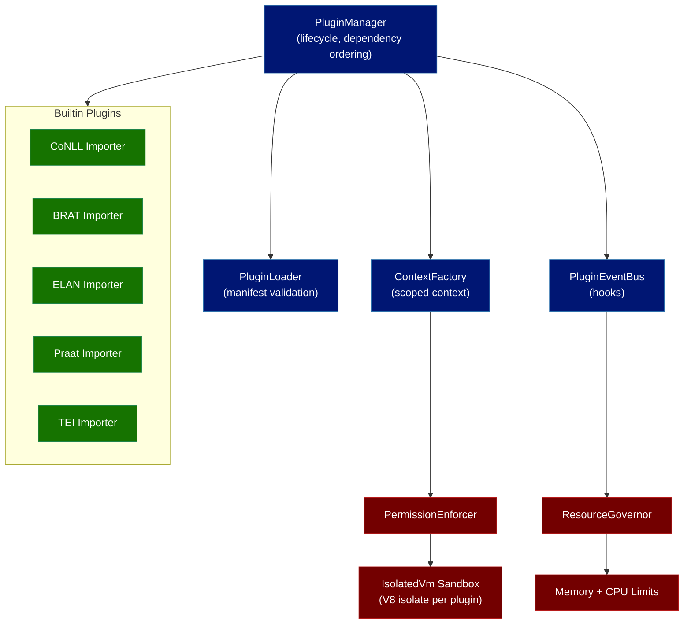
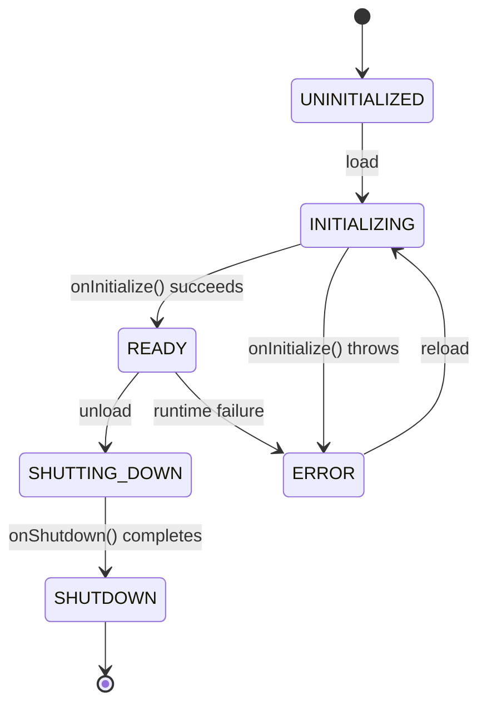

# Plugin System

## Overview

The Layers appview extends its capabilities through a plugin system adapted from [Chive's](https://chive.pub) production architecture. Plugins run in sandboxed V8 isolates (via `isolated-vm`), subscribe to lifecycle events through a permission-filtered event bus, and interact with appview services through a scoped context object. The system supports two primary plugin categories: **format importers** (converting annotation formats like CoNLL-U, BRAT, ELAN, Praat, and TEI into Layers records) and **harvesters** (pulling metadata from external sources).

All plugins follow ATProto compliance rules: they can read firehose events and cache computed results but never write directly to user PDSes. Format importers that create records do so through the user's authenticated OAuth session, so the user's PDS remains the authoritative source.

## Architecture



### Component Responsibilities

| Component | Role |
|---|---|
| **PluginManager** | Lifecycle orchestration (load, initialize, reload, shutdown), dependency resolution via topological sort |
| **PluginLoader** | Discovers plugins in the `plugins/` directory, validates manifests against JSON Schema using AJV |
| **ContextFactory** | Creates per-plugin scoped contexts with namespaced logger, cache, metrics, and filtered event bus |
| **PluginEventBus** | EventEmitter2-based async event system with wildcard pattern support |
| **PermissionEnforcer** | Runtime validation of network access (domain allowlist), hook subscriptions, and storage quotas |
| **ResourceGovernor** | Tracks per-plugin memory usage, CPU time (rolling 60-second window), and storage consumption |
| **IsolatedVmSandbox** | Creates separate V8 isolates per plugin with enforced memory and CPU limits |

## Plugin Manifest

Every plugin requires a `manifest.json` that declares its identity, permissions, and entry point:

```json
{
  "id": "pub.layers.plugin.conll-importer",
  "name": "CoNLL Importer",
  "version": "1.0.0",
  "description": "Imports CoNLL-U and CoNLL-2003 files into Layers records",
  "author": "Layers Contributors",
  "license": "MIT",
  "permissions": {
    "hooks": ["import.requested", "import.completed"],
    "network": {
      "allowedDomains": []
    },
    "storage": {
      "maxSize": 10485760
    }
  },
  "entrypoint": "dist/index.js",
  "dependencies": []
}
```

### Manifest Fields

| Field | Required | Description |
|---|---|---|
| `id` | Yes | Unique reverse-domain identifier (e.g., `pub.layers.plugin.conll-importer`) |
| `name` | Yes | Human-readable name |
| `version` | Yes | Semantic version (major.minor.patch) |
| `description` | Yes | Brief description of what the plugin does |
| `author` | Yes | Author name or organization |
| `license` | Yes | SPDX license identifier |
| `permissions.hooks` | Yes | Array of event hook patterns the plugin may subscribe to (supports `*` wildcard) |
| `permissions.network.allowedDomains` | Yes | Domains the plugin may contact (supports `*.example.com` wildcards) |
| `permissions.storage.maxSize` | Yes | Maximum cache storage in bytes |
| `entrypoint` | Yes | Path to the compiled plugin entry point relative to the plugin directory |
| `dependencies` | No | Array of plugin IDs that must be loaded first |

## Sandbox Isolation

External and third-party plugins run inside `isolated-vm` V8 isolates. Each plugin gets its own isolate with no access to Node.js APIs, the filesystem, or the network. Communication with appview services happens exclusively through the scoped context object, which the sandbox injects as a frozen copy.

### How Isolation Works

```typescript
import ivm from 'isolated-vm';

const isolate = new ivm.Isolate({ memoryLimit: memoryLimitMB });
const vmContext = await isolate.createContext();

// Inject scoped context as a frozen external copy
const contextRef = new ivm.ExternalCopy(scopedContext);
await vmContext.global.set('__layersContext', contextRef.copyInto());

// Compile and run the plugin entry point
const script = await isolate.compileScript(pluginCode);
const result = await script.run(vmContext, { timeout: timeoutMs });
```

### What the Sandbox Blocks

- `require()`, `import()`, and all Node.js built-in modules (`fs`, `net`, `child_process`, etc.)
- `process`, `global`, `globalThis` (replaced with the sandbox's own global scope)
- Direct network access (`fetch`, `XMLHttpRequest`, `WebSocket`)
- `eval()` and `Function()` constructors (the isolate's own compile path is the only code execution mechanism)

Network requests are proxied through the `PermissionEnforcer`, which checks each outbound domain against the manifest's allowlist before forwarding the request.

### Resource Limits

| Resource | Default Limit | Description |
|---|---|---|
| Memory | 128 MB | V8 heap size per isolate |
| CPU | 5,000 ms | Per-operation execution timeout |
| Storage | 1 MB (configurable) | Cache quota per plugin |
| Network | Allowlist only | Only domains declared in the manifest |

The `ResourceGovernor` monitors memory and CPU consumption over a rolling 60-second window. If a plugin exceeds its allocation, the isolate is terminated and the plugin transitions to the `ERROR` state.

### Builtin Plugin Exception

Builtin plugins (the format importers and any first-party harvesters shipped with the appview) run in the main Node.js process rather than in isolated-vm sandboxes. They extend `BasePlugin` directly and have full access to appview internals. This avoids the serialization overhead of crossing the isolate boundary for trusted code that processes large annotation files.

## Plugin Lifecycle

Plugins follow a state machine with five states:



The `PluginManager` resolves dependencies via topological sort before loading. If plugin B declares plugin A as a dependency, A is initialized first and shut down last.

### BasePlugin Class

All builtin plugins extend `BasePlugin`, which provides lifecycle hooks, configuration access, and metrics helpers:

```typescript
import { BasePlugin } from './base-plugin.js';
import type { IPluginContext, IPluginManifest } from '../types/plugin.interface.js';

export class MyPlugin extends BasePlugin {
  readonly id = 'pub.layers.plugin.my-plugin';
  readonly manifest: IPluginManifest = { /* ... */ };

  protected async onInitialize(): Promise<void> {
    this.context.eventBus.on('expression.indexed', this.handleExpression.bind(this));
    this.context.logger.info('Plugin initialized');
  }

  protected async onShutdown(): Promise<void> {
    this.context.logger.info('Plugin shutting down');
  }

  private async handleExpression(event: { uri: string }): Promise<void> {
    const timer = this.startTimer('expression_processing');
    try {
      // Process the event
      await this.context.cache.set(`processed:${event.uri}`, { at: new Date().toISOString() }, 3600);
      this.recordCounter('expressions_processed', { status: 'success' });
    } finally {
      timer.end();
    }
  }
}
```

## Plugin Context

Each plugin receives a scoped context that namespaces all interactions to prevent cross-plugin interference:

```typescript
interface IPluginContext {
  /** Logger with the plugin ID in every log entry */
  logger: ILogger;

  /** Cache with keys automatically prefixed by plugin ID */
  cache: ICacheProvider;

  /** Metrics with a `plugin_id` label on every counter/histogram */
  metrics: IMetrics;

  /** Event bus filtered to only the hooks declared in the manifest */
  eventBus: IScopedPluginEventBus;

  /** Plugin-specific configuration (from manifest or runtime overrides) */
  config: Record<string, unknown>;
}
```

The `ContextFactory` constructs these scoped wrappers at load time. For example, if plugin `pub.layers.plugin.conll-importer` calls `cache.set('parsed', data)`, the actual Redis key becomes `plugin:pub.layers.plugin.conll-importer:parsed`.

## Event System

### Available Hooks

Layers extends Chive's event hooks with annotation-specific lifecycle events:

| Hook | Payload | Description |
|---|---|---|
| `expression.indexed` | `{ uri, did, text, language }` | Expression record indexed |
| `expression.updated` | `{ uri, previousCid, currentCid }` | Expression record updated |
| `expression.deleted` | `{ uri }` | Expression record deleted |
| `segmentation.indexed` | `{ uri, expressionUri }` | Segmentation record indexed |
| `annotation.indexed` | `{ uri, expressionUri, kind, subkind, formalism }` | Annotation layer indexed |
| `annotation.deleted` | `{ uri }` | Annotation layer deleted |
| `corpus.indexed` | `{ uri, name }` | Corpus record indexed |
| `ontology.indexed` | `{ uri, domain }` | Ontology record indexed |
| `graph.indexed` | `{ uri, nodeOrEdge }` | Graph node or edge indexed |
| `import.requested` | `{ jobId, format, userId }` | Format import job started |
| `import.completed` | `{ jobId, recordCount }` | Format import job finished |
| `import.failed` | `{ jobId, error }` | Format import job failed |
| `enrichment.completed` | `{ uri, enrichmentType }` | Enrichment job finished for a record |
| `system.startup` | `{}` | Appview starting |
| `system.shutdown` | `{}` | Appview shutting down |
| `plugin.loaded` | `{ pluginId }` | Another plugin loaded |
| `plugin.unloaded` | `{ pluginId }` | Another plugin unloaded |

Plugins can only subscribe to hooks declared in their manifest. The `ScopedEventBus` silently drops subscription attempts for undeclared hooks and logs a warning.

### Error Isolation

If one handler throws, the error is caught, logged, and the event continues propagating to other handlers. A single misbehaving plugin cannot block the event pipeline.

## Format Importer Interface

Format importers are the primary plugin category for Layers. Each importer converts a standard annotation format into Layers `pub.layers.*` records. The import pipeline is documented in [Background Jobs](./background-jobs); this section covers the plugin interface.

### ImporterPlugin Base Class

```typescript
import { BasePlugin } from './base-plugin.js';

export interface ImportResult {
  /** AT-URIs of all records created during the import */
  createdRecords: string[];
  /** Warnings (e.g., unsupported features that were skipped) */
  warnings: string[];
}

export interface ImportRequest {
  /** Raw file content (text or binary) */
  fileContent: Buffer;
  /** Original filename (used for format detection) */
  filename: string;
  /** Target corpus AT-URI (optional) */
  corpusUri?: string;
  /** User's authenticated ATProto session for writing records to their PDS */
  session: OAuthSession;
  /** User's DID */
  did: string;
}

export abstract class ImporterPlugin extends BasePlugin {
  /** File extensions this importer handles (e.g., ['.conllu', '.conll']) */
  abstract readonly supportedExtensions: string[];

  /** Human-readable format name for UI display */
  abstract readonly formatName: string;

  /**
   * Parse the input file and return Layers record objects.
   * The records are not yet written; the pipeline validates
   * them against Lexicon schemas before writing.
   */
  abstract parse(request: ImportRequest): Promise<ParsedRecords>;

  /**
   * Optional: export Layers records back to the original format.
   * Used for round-trip testing and data portability.
   */
  export?(records: ParsedRecords): Promise<Buffer>;
}

export interface ParsedRecords {
  expressions: ExpressionRecord[];
  segmentations: SegmentationRecord[];
  annotationLayers: AnnotationLayerRecord[];
  media?: MediaRecord[];
  corpora?: CorpusRecord[];
}
```

### Import Pipeline

When a user requests a format import (via the REST API), the pipeline:

1. **Dispatches** the file to the matching importer plugin based on file extension
2. **Parses** the file using the plugin's `parse()` method, producing Layers record objects
3. **Validates** every generated record against its Lexicon JSON schema using `@atproto/lexicon`
4. **Writes** the records to the user's PDS via `com.atproto.repo.createRecord` XRPC calls, using the user's OAuth session
5. **Indexes** the records automatically as the firehose picks them up from the PDS

The plugin itself never writes to the PDS. The appview pipeline handles writing through the user's session, ensuring ATProto data sovereignty.

### Builtin Importers

| Plugin ID | Format | Extensions | Records Produced | Reference Docs |
|---|---|---|---|---|
| `pub.layers.plugin.conll-importer` | CoNLL-U, CoNLL-2003 | `.conllu`, `.conll` | expression + segmentation + annotationLayer (POS, lemma, deps, NER) | [CoNLL Integration](../integration/data-models/conll) |
| `pub.layers.plugin.brat-importer` | BRAT standoff | `.ann` + `.txt` | expression + segmentation + annotationLayer (entities, relations, events) | [brat Integration](../integration/data-models/brat) |
| `pub.layers.plugin.elan-importer` | ELAN | `.eaf` | expression + media + segmentation + annotationLayer (per tier) | [ELAN/Praat Integration](../integration/data-models/elan-praat) |
| `pub.layers.plugin.praat-importer` | Praat TextGrid | `.TextGrid` | expression + media + segmentation + annotationLayer (intervals, points) | [ELAN/Praat Integration](../integration/data-models/elan-praat) |
| `pub.layers.plugin.tei-importer` | TEI XML | `.xml` | expression + corpus + annotationLayer (inline annotations) | [TEI Integration](../integration/data-models/tei) |

Each importer follows the mappings documented in the corresponding [Data Model Integration](../integration/data-models/) page. For example, the CoNLL importer maps CoNLL-U columns to Layers record fields as described in the [CoNLL integration guide](../integration/data-models/conll).

### Example: CoNLL-U Import

A CoNLL-U file like:

```
# sent_id = 1
# text = The cat sat on the mat.
1	The	the	DET	DT	_	2	det	_	_
2	cat	cat	NOUN	NN	_	3	nsubj	_	_
3	sat	sit	VERB	VBD	_	0	root	_	_
4	on	on	ADP	IN	_	6	case	_	_
5	the	the	DET	DT	_	6	det	_	_
6	mat	mat	NOUN	NN	_	3	nmod	_	_
7	.	.	PUNCT	.	_	3	punct	_	_
```

produces the following Layers records:

1. **`expression.expression`**: `{ text: "The cat sat on the mat.", language: "en", kind: "sentence" }`
2. **`segmentation.segmentation`**: `{ expression: <expression-uri>, kind: "token", segments: [{ text: "The", startChar: 0, endChar: 3 }, ...] }`
3. **`annotation.annotationLayer`** (POS): `{ expression: <expression-uri>, kind: "token-tag", subkind: "pos", formalism: "universal-dependencies", annotations: [{ tokenIndex: 0, label: "DET" }, ...] }`
4. **`annotation.annotationLayer`** (lemma): `{ expression: <expression-uri>, kind: "token-tag", subkind: "lemma", annotations: [{ tokenIndex: 0, label: "the" }, ...] }`
5. **`annotation.annotationLayer`** (deps): `{ expression: <expression-uri>, kind: "relation", subkind: "dependency", formalism: "universal-dependencies", annotations: [{ headIndex: 2, depIndex: 0, label: "det" }, ...] }`

## Harvester Interface

Harvesters are plugins that pull metadata from external sources and cache it for enrichment. Layers adapts Chive's `ImportingPlugin` pattern for linguistic resource harvesting rather than eprint harvesting.

### HarvesterPlugin Base Class

```typescript
export interface HarvestedRecord {
  externalId: string;
  url: string;
  title: string;
  metadata: Record<string, unknown>;
}

export abstract class HarvesterPlugin extends BasePlugin {
  /** Yield harvested records as an async iterable (supports pagination) */
  abstract fetchRecords(options?: FetchOptions): AsyncIterable<HarvestedRecord>;

  /** Rate limit delay between requests in milliseconds */
  abstract readonly rateLimitMs: number;
}

export interface FetchOptions {
  since?: Date;
  limit?: number;
}
```

### Potential Harvesters

These harvesters are planned for future development:

| Plugin ID | Source | Purpose |
|---|---|---|
| `pub.layers.plugin.wikidata-harvester` | Wikidata SPARQL | Enrich `knowledgeRefs` pointing to Wikidata entities with labels, descriptions, and type hierarchies |
| `pub.layers.plugin.wordnet-harvester` | Open Multilingual Wordnet | Resolve WordNet synset references in annotation layers |
| `pub.layers.plugin.ud-harvester` | Universal Dependencies | Import UD treebanks as reference corpora with POS, lemma, and dependency annotations |

Harvesters cache their results in Redis (via the plugin's scoped cache) with configurable TTLs. All cached data is ephemeral and rebuildable from the external source.

## Plugin Registry

The plugin registry uses TSyringe for dependency injection, matching Chive's pattern:

```typescript
import { container } from 'tsyringe';

export function registerPluginSystem(): void {
  container.registerSingleton('PluginEventBus', PluginEventBus);
  container.registerSingleton('PermissionEnforcer', PermissionEnforcer);
  container.registerSingleton('ResourceGovernor', ResourceGovernor);
  container.registerSingleton('IsolatedVmSandbox', IsolatedVmSandbox);
  container.registerSingleton('PluginContextFactory', PluginContextFactory);
  container.registerSingleton('PluginLoader', PluginLoader);
  container.registerSingleton('PluginManager', PluginManager);
}

export function getPluginManager(): PluginManager {
  return container.resolve('PluginManager');
}
```

### Loading Builtin Plugins

At startup, the appview registers all builtin importers:

```typescript
const manager = getPluginManager();

await manager.loadBuiltinPlugin(new ConllImporterPlugin());
await manager.loadBuiltinPlugin(new BratImporterPlugin());
await manager.loadBuiltinPlugin(new ElanImporterPlugin());
await manager.loadBuiltinPlugin(new PraatImporterPlugin());
await manager.loadBuiltinPlugin(new TeiImporterPlugin());
```

### Loading External Plugins

External plugins are discovered by scanning the `plugins/` directory for `manifest.json` files:

```typescript
const manifests = await loader.scanDirectory(config.pluginsDir);
for (const manifest of manifests) {
  await manager.loadPlugin(manifest);
}
```

The `PluginLoader` validates each manifest against a JSON Schema (using AJV) before loading. Invalid manifests are rejected with detailed validation errors.

## Security Model

### Permission Enforcement

All plugin operations pass through the `PermissionEnforcer` at runtime:

| Check | Mechanism | On Violation |
|---|---|---|
| Hook subscription | Manifest `hooks` array checked before event registration | `PluginPermissionError`, subscription silently dropped |
| Network access | Outbound domain matched against `allowedDomains` (supports wildcards) | `SandboxViolationError`, request blocked |
| Storage quota | Byte count tracked per plugin, checked before cache writes | `SandboxViolationError`, write rejected |
| Resource limits | Memory and CPU monitored by `ResourceGovernor` | Isolate terminated, plugin set to `ERROR` state |

### ATProto Compliance

Plugins must follow ATProto's data sovereignty model:

**Plugins CAN:**
- Subscribe to firehose events via the event bus
- Cache computed results with TTLs (all cached data must be rebuildable)
- Call external APIs for enrichment (within their declared domain allowlist)
- Read from user PDSes via repository interfaces

**Plugins CANNOT:**
- Write directly to user PDSes (format importers write through the pipeline's OAuth session)
- Store blob data (only `BlobRef` references)
- Create persistent state that cannot be rebuilt from the firehose or external sources
- Bypass permission checks or escape the sandbox

### Error Handling

Plugin errors are categorized into three types:

| Error Type | Cause | Recovery |
|---|---|---|
| `PluginError` | General plugin failure (initialization crash, unhandled exception) | Plugin set to `ERROR`, can be reloaded |
| `PluginPermissionError` | Attempted operation not declared in manifest | Operation rejected, plugin continues running |
| `SandboxViolationError` | Memory/CPU exceeded, unauthorized network access | Isolate terminated, plugin set to `ERROR` |

All plugin errors are logged with the plugin ID and do not propagate to the main appview process. A crashing plugin cannot take down the indexer or API server.

## Testing Plugins

### Unit Testing

Plugin unit tests mock the `IPluginContext` interface:

```typescript
import { describe, it, expect, vi, beforeEach } from 'vitest';

describe('ConllImporterPlugin', () => {
  let plugin: ConllImporterPlugin;
  let mockContext: IPluginContext;

  beforeEach(() => {
    mockContext = {
      logger: createMockLogger(),
      cache: createMockCache(),
      metrics: createMockMetrics(),
      eventBus: createMockEventBus(),
      config: {},
    };
    plugin = new ConllImporterPlugin();
  });

  it('should parse a CoNLL-U file into Layers records', async () => {
    const conlluContent = Buffer.from('# text = Hello world\n1\tHello\thello\tINTJ\tUH\t_\t0\troot\t_\t_\n2\tworld\tworld\tNOUN\tNN\t_\t1\tflat\t_\t_\n');

    const result = await plugin.parse({
      fileContent: conlluContent,
      filename: 'test.conllu',
      did: 'did:plc:test',
      session: mockOAuthSession,
    });

    expect(result.expressions).toHaveLength(1);
    expect(result.expressions[0].text).toBe('Hello world');
    expect(result.segmentations).toHaveLength(1);
    expect(result.annotationLayers).toHaveLength(3); // POS, lemma, deps
  });
});
```

### Sandbox Security Tests

Integration tests verify that the sandbox correctly isolates untrusted code:

```typescript
describe('IsolatedVmSandbox', () => {
  it('should prevent access to Node.js APIs', async () => {
    const result = await sandbox.executeInSandbox(isolate, `
      try { require('fs'); return 'escaped'; }
      catch { return 'blocked'; }
    `, {});
    expect(result).toBe('blocked');
  });

  it('should enforce memory limits', async () => {
    await expect(sandbox.executeInSandbox(isolate, `
      const arr = [];
      while (true) arr.push(new Array(1000000));
    `, {})).rejects.toThrow();
  });

  it('should enforce CPU timeout', async () => {
    await expect(sandbox.executeInSandbox(isolate, `
      while (true) {}
    `, {})).rejects.toThrow();
  });
});
```

### Format Import Round-Trip Tests

See [Testing Strategy](./testing-strategy) for the full round-trip test suite that verifies each importer against reference files.

## See Also

- [Background Jobs](./background-jobs) for the format import job pipeline and queue topology
- [Technology Stack](./technology-stack) for `isolated-vm`, `tsyringe`, and `EventEmitter2` versions
- [Indexing Strategy](./indexing-strategy) for how imported records are indexed after creation
- [Data Model Integration](../integration/data-models/) for per-format mapping documentation (CoNLL, BRAT, ELAN, TEI, etc.)
- [Testing Strategy](./testing-strategy) for format import round-trip tests and plugin compliance tests
