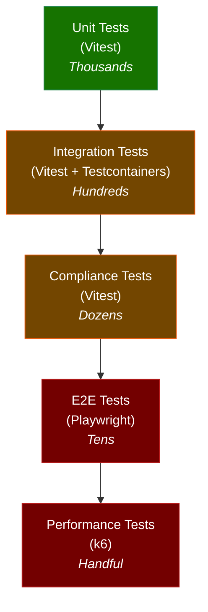

# Testing Strategy

## Testing Pyramid

The appview uses a multi-tier testing strategy with decreasing test count and increasing scope at each level:



## Test Configuration Files

Following Chive's pattern, four separate Vitest configs target different test tiers:

| Config | Scope | Database Required |
|--------|-------|-------------------|
| `vitest.unit.config.ts` | Unit tests with mocks | No |
| `vitest.config.ts` | Integration tests with Testcontainers | Yes (PG, ES, Neo4j, Redis) |
| `vitest.compliance.config.ts` | Lexicon schema compliance | Yes |
| `vitest.pre-deployment.config.ts` | Staging health checks | Staging environment |

A top-level `__mocks__/` directory provides manual mocks (e.g., `__mocks__/isolated-vm.js`) shared across all test tiers. Storage adapter tests are co-located in `src/storage/*/__tests__/`.

## Unit Tests

**Tool:** Vitest 4+
**Config:** `vitest.unit.config.ts`
**Run:** `pnpm test:unit`

Unit tests cover individual functions and classes in isolation, with all external dependencies mocked.

### What to Unit Test

| Component | Tests |
|---|---|
| Record handlers | Field extraction, ES document construction, Neo4j operation generation |
| Validation schemas | Zod schema acceptance and rejection for each record type |
| Cross-reference extraction | Correct ref types and URIs extracted from each record type |
| Query builders | SQL, ES JSON, and Cypher query construction from API parameters |
| Cache key generation | Correct key patterns and TTL values |
| Error formatting | Structured error response generation |

### Mocking Strategy

- Database clients: mocked via Vitest's `vi.mock()` or manual test doubles
- Redis: mocked with in-memory Map (via `ioredis-mock`)
- `isolated-vm`: mocked in top-level `__mocks__/isolated-vm.js` (returns deterministic sandbox results)
- ATProto client: mocked to return fixture records

### Coverage Requirements

| Metric | Threshold |
|---|---|
| Lines | 80% |
| Functions | 80% |
| Statements | 80% |
| Branches | 75% |

## Integration Tests

**Tool:** Vitest 4+ with [Testcontainers](https://testcontainers.com/)
**Config:** `vitest.config.ts`
**Run:** `pnpm test:integration`

Integration tests run against real database instances spun up as ephemeral containers. Each test suite gets a clean database state.

### Testcontainers Setup

```typescript
import { PostgreSqlContainer } from '@testcontainers/postgresql';
import { ElasticsearchContainer } from '@testcontainers/elasticsearch';
import { Neo4jContainer } from '@testcontainers/neo4j';
import { RedisContainer } from '@testcontainers/redis';

let pgContainer: StartedPostgreSqlContainer;
let esContainer: StartedElasticsearchContainer;
let neo4jContainer: StartedNeo4jContainer;
let redisContainer: StartedRedisContainer;

beforeAll(async () => {
  [pgContainer, esContainer, neo4jContainer, redisContainer] = await Promise.all([
    new PostgreSqlContainer('postgres:16-alpine').start(),
    new ElasticsearchContainer('elasticsearch:8.11.0').start(),
    new Neo4jContainer('neo4j:5').start(),
    new RedisContainer('redis:7-alpine').start(),
  ]);
  // Run migrations, create indexes, seed test data
});
```

### What to Integration Test

| Component | Tests |
|---|---|
| Firehose handlers | End-to-end record ingestion: handler → PG + ES + Neo4j writes |
| API endpoints | Full request cycle: HTTP request → middleware → service → database → response |
| Cross-reference resolution | Forward and back-reference handling across record types |
| Search | ES queries return correct results for faceted annotation search |
| Graph traversal | Neo4j Cypher queries return correct paths and neighborhoods |
| Cache | Redis cache population, hit/miss behavior, and invalidation |

### Fixture Library

A shared fixture library provides factory functions for generating valid Layers records:

```typescript
const expression = fixtures.expression({
  text: 'The cat sat on the mat.',
  language: 'en',
  kind: 'sentence',
});

const annotationLayer = fixtures.annotationLayer({
  expression: expression.uri,
  kind: 'token-tag',
  subkind: 'pos',
  formalism: 'universal-dependencies',
  annotations: [
    { tokenIndex: 0, label: 'DET' },
    { tokenIndex: 1, label: 'NOUN' },
    // ...
  ],
});
```

## Compliance Tests

**Tool:** Vitest 4+
**Config:** `vitest.compliance.config.ts`
**Run:** `pnpm test:compliance`

Compliance tests verify that the appview correctly handles all 26 record types according to their Lexicon JSON schemas.

### Schema Compliance

For each of the 26 record types:
1. Generate a valid record from the fixture library
2. Validate it against the Lexicon JSON schema using `@atproto/lexicon`
3. Index it through the handler
4. Retrieve it via the XRPC `get*` endpoint
5. Verify the response matches the original record

### XRPC Protocol Compliance

For each of the 38+ XRPC query endpoints:
1. Verify correct parameter validation (required fields, type checking)
2. Verify correct error codes (404 for missing records, 400 for invalid params)
3. Verify cursor-based pagination produces complete, non-overlapping result sets

### Edge Cases

- Maximum-size records (annotations array with 1000 entries)
- Unicode edge cases (RTL text, combining characters, emoji in labels)
- Empty optional fields vs. missing fields
- AT-URIs with unusual but valid rkey formats

## Format Import Round-Trip Tests

For each supported import format (CoNLL-U, BRAT, ELAN, Praat, TEI):

1. **Import**: Load a reference file through the importer plugin
2. **Verify**: Check that the generated Layers records match expected structure
3. **Export**: (when exporter is available) Convert back to the original format
4. **Compare**: Verify no information loss in the round-trip

Test fixtures include reference files from the [data model integration documentation](../integration/data-models/):

| Format | Reference File | Records Expected |
|---|---|---|
| CoNLL-U | `test/fixtures/en_ewt-sample.conllu` | 1 expression, 1 segmentation, 3 annotation layers (POS, lemma, deps) |
| BRAT | `test/fixtures/sample.ann` + `sample.txt` | 1 expression, 1 segmentation, 2 annotation layers (entities, relations) |
| ELAN | `test/fixtures/sample.eaf` | 1 expression, 1 media, 2 segmentations, 4 annotation layers (per tier) |

## Performance Tests

**Tool:** k6
**Run:** `pnpm test:performance`

### Load Scenarios

| Scenario | Description | Target |
|---|---|---|
| Record ingestion | Simulate firehose burst of 10,000 records/sec | < 100ms p99 handler latency |
| Search queries | 100 concurrent faceted annotation searches | < 200ms p95 response time |
| Graph traversal | 50 concurrent 3-hop neighborhood queries | < 500ms p95 response time |
| Mixed workload | Realistic mix of reads (80%) and ingestion (20%) | No degradation from single-workload baselines |

### Baseline Establishment

Performance tests run in CI against a staging environment after each release. Results are compared against baselines stored in the repository. A > 20% regression in any p95 metric fails the pipeline.

## Pre-Deployment Tests

**Tool:** Vitest 4+
**Config:** `vitest.pre-deployment.config.ts`
**Run:** `pnpm test:pre-deployment`

Pre-deployment tests run against the staging environment after deployment to verify:

- API health endpoints respond correctly
- All four database connections are healthy
- Firehose consumer is connected and processing events
- XRPC endpoints return valid responses for known test records
- Rate limiting is enforced at configured tiers

These tests are automatically triggered by the CI/CD pipeline after staging deployment and must pass before production promotion.

## CI Integration

### Test Pipeline Configuration

```yaml
# Simplified CI pipeline stages
stages:
  - lint-and-typecheck:
      commands:
        - pnpm lint
        - pnpm typecheck
  - unit-tests:
      commands:
        - pnpm test:unit --coverage
  - integration-tests:
      services: [postgres, elasticsearch, neo4j, redis]
      commands:
        - pnpm test:integration
  - compliance-tests:
      services: [postgres, elasticsearch, neo4j, redis]
      commands:
        - pnpm test:compliance
  - e2e-tests:
      environment: staging
      commands:
        - pnpm test:e2e
  - performance-tests:
      environment: staging
      trigger: release-only
      commands:
        - pnpm test:performance
```

Unit tests and lint/typecheck run on every push. Integration and compliance tests run on every PR. E2E tests run against the staging environment after merge. Performance tests run on release candidates.

## Future Considerations

- **Vitest browser mode**: Vitest 4+ supports browser mode for component tests, which could be used for frontend testing in the `web/` directory.
- **Testcontainers Cloud**: Shared container pools in CI for faster test execution and reduced resource consumption.

## See Also

- [Technology Stack](./technology-stack) for Vitest, Playwright, and k6 versions
- [Deployment](./deployment) for CI/CD pipeline configuration
- [Plugin System](./plugin-system) for format importer testing
