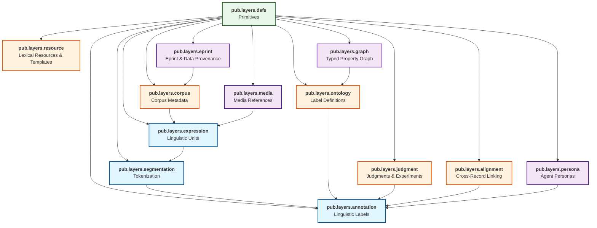

# Lexicon Overview

Layers consists of 13 lexicons organized into core pipeline layers, parallel tracks, and integration layers.

## Lexicon Directory

| Namespace | Record NSIDs | Purpose |
|-----------|-------------|---------|
| [Definitions](../lexicons/defs.md) | `pub.layers.defs` | Core primitives: objectRef, anchor, constraint, agentRef, annotationMetadata, knowledgeRef, featureMap, alignmentLink |
| [Expression](../lexicons/expression.md) | `pub.layers.expression.expression` | Any linguistic unit (document, paragraph, sentence, word, morpheme) with recursive nesting |
| [Segmentation](../lexicons/segmentation.md) | `pub.layers.segmentation.segmentation`, `pub.layers.segmentation.defs` | Tokenization strategies, token sequences, sub-expression scoping |
| [Annotation](../lexicons/annotation.md) | `pub.layers.annotation.annotationLayer`, `pub.layers.annotation.clusterSet`, `pub.layers.annotation.defs` | Linguistic labels and categories (POS, NER, SRL, discourse, etc.) |
| [Ontology](../lexicons/ontology.md) | `pub.layers.ontology.ontology`, `pub.layers.ontology.typeDef`, `pub.layers.ontology.defs` | Label definitions, linguistic categories, theory/framework records |
| [Corpus](../lexicons/corpus.md) | `pub.layers.corpus.corpus`, `pub.layers.corpus.membership`, `pub.layers.corpus.defs` | Corpus metadata, membership, and statistics |
| [Resource](../lexicons/resource.md) | `pub.layers.resource.entry`, `pub.layers.resource.collection`, `pub.layers.resource.template`, `pub.layers.resource.filling`, `pub.layers.resource.templateComposition`, `pub.layers.resource.collectionMembership`, `pub.layers.resource.defs` | Lexical entries, collections, stimulus templates, fillings, and template compositions |
| [Judgment](../lexicons/judgment.md) | `pub.layers.judgment.experimentDef`, `pub.layers.judgment.judgmentSet`, `pub.layers.judgment.agreementReport`, `pub.layers.judgment.defs` | Human judgments, model predictions, confidence, disagreement, experiment design |
| [Alignment](../lexicons/alignment.md) | `pub.layers.alignment.alignment` | Cross-record linking, token correspondence, equivalence |
| [Graph](../lexicons/graph.md) | `pub.layers.graph.graphNode`, `pub.layers.graph.graphEdge`, `pub.layers.graph.graphEdgeSet`, `pub.layers.graph.defs` | Generic typed property graph for knowledge representation and cross-referencing |
| [Persona](../lexicons/persona.md) | `pub.layers.persona.persona` | Agent personas, theoretical frameworks, backgrounds |
| [Media](../lexicons/media.md) | `pub.layers.media.media`, `pub.layers.media.defs` | Audio, video, image, and paged document references |
| [Eprint](../lexicons/eprint.md) | `pub.layers.eprint.eprint`, `pub.layers.eprint.dataLink`, `pub.layers.eprint.defs` | Eprint linkage, data provenance, scholarly metadata, reproducibility |

## Lexicon Organization

### Core Pipeline

The **pipeline layers** build incrementally, each depending on primitives and the layer before:

```
pub.layers.defs (Primitives)
    ↓
pub.layers.expression (Linguistic Units)
    ↓
pub.layers.segmentation (Tokenization)
    ↓
pub.layers.annotation (Labels)
```

Expressions are recursive: a document contains paragraphs, which contain sentences, which contain words. Each expression can reference its parent via `parentRef`. Structure types (section, sentence, word, morpheme, etc.) are expression `kind` values, not a separate lexicon. Segmentation records provide tokenizations that decompose expressions into ordered token sequences.

### Parallel Tracks

These lexicons support the pipeline but do not depend on each other in strict order:

- **pub.layers.ontology**: Authority records for labels and categories (supports annotation)
- **pub.layers.corpus**: Corpus metadata, membership, and statistics (organizes expressions)
- **pub.layers.resource**: Lexical entries, collections, stimulus templates, and fillings (supports experiments)
- **pub.layers.judgment**: Human and model judgments, experiment design (supports annotation and alignment)
- **pub.layers.alignment**: Cross-record correspondence (integrates across layers)

### Integration Layers

These lexicons connect Layers to the ATProto ecosystem:

- **pub.layers.graph**: Generic typed property graph with nodes, edges, and edge sets for representing knowledge, cross-document relations, and arbitrary typed relationships
- **pub.layers.persona**: Agent personas and theoretical frameworks for annotator/model attribution
- **pub.layers.media**: Audio, video, image, and paged document references
- **pub.layers.eprint**: Eprint linkage, data provenance, reproducibility information, and scholarly metadata

## Dependency Graph



## Pipeline Layers

### pub.layers.defs (Primitives)

Foundation for all other lexicons. Defines abstract, composable primitives:

- `objectRef`: cross-referencing mechanism
- `anchor`: polymorphic attachment points
- `constraint`: DSL-agnostic expressions
- `agentRef`: agent identity
- `annotationMetadata`: provenance tracking (including `dependencies` for provenance chains)
- `knowledgeRef`: external KB references (ATProto-native, external, or user-specific)
- `featureMap`: open-ended extensibility
- `alignmentLink`: sequence correspondence

**Depends on**: Nothing (foundational)

**Used by**: All other lexicons

**File**: `schemas/pub/layers/defs.json`

### pub.layers.expression (Linguistic Units)

Any linguistic unit, from a single morpheme to a full document, with recursive nesting:

- Source data (text, audio, video, image, paged documents)
- Recursive nesting via `parentRef` (document → paragraph → sentence → word → morpheme)
- Multimodal anchoring to parent expressions
- Language identification and multilingual support
- Links to eprints and knowledge bases

**Depends on**: `pub.layers.defs`

**Used by**: All downstream layers

**Directory**: `schemas/pub/layers/expression/` (expression.json, defs.json, get/list queries)

### pub.layers.segmentation (Tokenization)

Provides token-level decomposition of expressions:

- Tokenization strategies (whitespace, BPE, morphological, etc.)
- Multiple tokenizations per expression for interlinear glossing or alternative segmentation
- Each tokenization can scope to a specific sub-expression via `expressionRef`
- Index-based access for efficient token retrieval

**Depends on**: `pub.layers.defs`, `pub.layers.expression`

**Used by**: `pub.layers.annotation`

**Directory**: `schemas/pub/layers/segmentation/` (segmentation.json, defs.json, get/list queries)

### pub.layers.annotation (Linguistic Annotations)

Labels, categories, semantic roles, discourse relations:

- Abstract annotation record type (discriminated by kind/subkind)
- Anchoring (to tokens, text spans, temporal regions, etc.)
- Flexible tagging: POS, NER, SRL, sentiment, discourse, relations, coreference, document-level tags
- K-best alternatives via `rank` and `alternativesRef`
- Cluster sets for coreference and cross-document clustering
- Metadata: confidence, provenance, source

**Depends on**: `pub.layers.defs`, `pub.layers.expression`, `pub.layers.segmentation`, `pub.layers.ontology`, `pub.layers.judgment`, `pub.layers.persona`

**Used by**: `pub.layers.alignment`, integration layers

**Directory**: `schemas/pub/layers/annotation/` (annotationLayer.json, clusterSet.json, defs.json, get/list queries)

## Parallel Support Layers

### pub.layers.ontology (Label Definitions)

Authority records for linguistic categories, tag sets, frameworks:

- Label definitions (POS tagsets, NER schemes, SRL frames)
- Theoretical framework definitions (generative syntax, construction grammar, etc.)
- Relation type properties (symmetric, transitive, reflexive, inverse, domain, range)
- Linked data to external KBs (Wikidata, WordNet, FrameNet, etc.)
- Authority records with versioning

**Depends on**: `pub.layers.defs`

**Used by**: `pub.layers.annotation`, `pub.layers.graph`

**Directory**: `schemas/pub/layers/ontology/` (ontology.json, typeDef.json, defs.json, get/list queries)

### pub.layers.corpus (Corpus Metadata)

Corpus records, membership, and statistics:

- Corpus definitions (name, description, license, citation)
- Expression membership (which expressions belong to a corpus)
- Corpus-level statistics and metadata

**Depends on**: `pub.layers.defs`, `pub.layers.expression`

**Used by**: `pub.layers.annotation` (corpus context), `pub.layers.eprint`

**Directory**: `schemas/pub/layers/corpus/` (corpus.json, membership.json, defs.json, get/list queries)

### pub.layers.resource (Lexical Resources & Templates)

Lexical entries, collections, stimulus templates, fillings, and compositions:

- Lexical resource entries (lemma, form, language, MWE components)
- Named collections (lexicons, frame inventories, gazetteers, paradigm tables)
- Parameterized text templates with named variable slots
- Template compositions (sequences and trees of templates)
- Filled templates with rendered text

**Depends on**: `pub.layers.defs`, `pub.layers.expression`

**Used by**: `pub.layers.judgment` (stimulus generation)

**Directory**: `schemas/pub/layers/resource/` (entry.json, collection.json, template.json, filling.json, templateComposition.json, collectionMembership.json, defs.json, get/list queries)

### pub.layers.judgment (Judgments & Experiments)

Human judgments, model predictions, experiment design:

- Experiment definitions with task types, guidelines, and design specifications
- List constraints (Latin square, balancing, adjacency rules)
- Judgment sets with behavioral analytics
- Inter-annotator agreement reports

**Depends on**: `pub.layers.defs`

**Used by**: `pub.layers.annotation`, applications for filtering/ranking

**Directory**: `schemas/pub/layers/judgment/` (experimentDef.json, judgmentSet.json, agreementReport.json, defs.json, get/list queries)

### pub.layers.alignment (Cross-Record Linking)

Linking annotations across records and layers:

- Token alignment (across language pairs, different tokenizations)
- Span correspondence (across different segmentations or annotations)
- Annotation equivalence (same meaning, different labels)
- Alignment confidence and metadata

**Depends on**: `pub.layers.defs`

**Used by**: All layers (enables multi-layer composition)

**Directory**: `schemas/pub/layers/alignment/` (alignment.json, get/list queries)

## Integration Layers

### pub.layers.graph (Typed Property Graph)

Generic typed property graph for knowledge representation and cross-referencing:

- Standalone graph nodes (entities, concepts, events, states, claims, propositions)
- Typed directed edges between any Layers objects (expressions, annotations, graph nodes, external KB nodes)
- Batch edge sets for efficient bulk operations
- Supports multidigraphs and cycles
- Subsumes cross-document relations, knowledge grounding, expression graphs, and intertextual linking

**Depends on**: `pub.layers.defs`, `pub.layers.ontology`

**Used by**: `pub.layers.annotation` (via knowledgeRef), all layers (via objectRef-based cross-referencing)

**Directory**: `schemas/pub/layers/graph/` (graphNode.json, graphEdge.json, graphEdgeSet.json, defs.json, get/list queries)

### pub.layers.persona (Agent Personas)

Agent personas, theoretical frameworks, methodological backgrounds:

- Persona records (annotator background, theoretical affiliation, expertise)
- Framework records (generative syntax, dependency grammar, UD conventions, etc.)
- Reproducibility metadata

**Depends on**: `pub.layers.defs`

**Used by**: `pub.layers.annotation` (via agentRef.personaRef)

**Directory**: `schemas/pub/layers/persona/` (persona.json, get/list queries)

### pub.layers.media (Multimodal References)

Audio, video, image, and paged document references:

- Audio/video file references (codec, sample rate, duration)
- Image file references (resolution, format, color space)
- Paged document references (page count, OCR metadata)
- Media-specific timestamps and spatial coordinates

**Depends on**: `pub.layers.defs`

**Used by**: `pub.layers.expression` (source documents), `pub.layers.segmentation` (temporal/spatial anchors)

**Directory**: `schemas/pub/layers/media/` (media.json, defs.json, get/list queries)

### pub.layers.eprint (Eprint & Data Provenance)

Eprint linkage, data provenance, reproducibility, and scholarly metadata:

- Eprint links (DOI, arXiv, ACL Anthology, any platform)
- Data links connecting publications to the data they produced (corpora, annotations, model outputs)
- Reproducibility information (code, commit hash, environment, random seed)
- Citation metadata

**Depends on**: `pub.layers.defs`, `pub.layers.corpus`

**Used by**: `pub.layers.expression` (eprintRef), discovery/search

**Directory**: `schemas/pub/layers/eprint/` (eprint.json, dataLink.json, defs.json, get/list queries)

## XRPC Queries

Every record type in Layers has corresponding XRPC query lexicons following a consistent `get<Record>` / `list<Records>` pattern. These queries enable efficient retrieval of individual records by AT-URI and paginated listing of records within a repository.

### Query Pattern

For each record NSID `pub.layers.<namespace>.<record>`, two query lexicons are generated:

| Query | NSID | Purpose |
|-------|------|---------|
| Get | `pub.layers.<namespace>.get<Record>` | Retrieve a single record by its AT-URI |
| List | `pub.layers.<namespace>.list<Records>` | List records of this type with pagination |

### Get Query Parameters

| Parameter | Type | Description |
|-----------|------|-------------|
| `uri` | at-uri (required) | The AT-URI of the record to retrieve |

**Output**: The full record object.

### List Query Parameters

| Parameter | Type | Description |
|-----------|------|-------------|
| `repo` | did (required) | The DID of the repository to list records from |
| `limit` | integer | Maximum number of records to return (1-100, default 50) |
| `cursor` | string | Pagination cursor from previous response |

**Output**: An object with `records` (array of record objects) and `cursor` (string, present if more results are available).

### Example: Annotation Queries

```
pub.layers.annotation.getAnnotationLayer    → retrieve a single annotation layer
pub.layers.annotation.listAnnotationLayers  → list annotation layers in a repo
pub.layers.annotation.getClusterSet         → retrieve a single cluster set
pub.layers.annotation.listClusterSets       → list cluster sets in a repo
```

### Complete Query Reference

| Namespace | Queries |
|-----------|---------|
| expression | `getExpression`, `listExpressions` |
| segmentation | `getSegmentation`, `listSegmentations` |
| annotation | `getAnnotationLayer`, `listAnnotationLayers`, `getClusterSet`, `listClusterSets` |
| ontology | `getOntology`, `listOntologies`, `getTypeDef`, `listTypeDefs` |
| corpus | `getCorpus`, `listCorpora`, `getMembership`, `listMemberships` |
| resource | `getEntry`, `listEntries`, `getCollection`, `listCollections`, `getTemplate`, `listTemplates`, `getFilling`, `listFillings`, `getTemplateComposition`, `listTemplateCompositions`, `getCollectionMembership`, `listCollectionMemberships` |
| judgment | `getExperimentDef`, `listExperimentDefs`, `getJudgmentSet`, `listJudgmentSets`, `getAgreementReport`, `listAgreementReports` |
| alignment | `getAlignment`, `listAlignments` |
| graph | `getGraphNode`, `listGraphNodes`, `getGraphEdge`, `listGraphEdges`, `getGraphEdgeSet`, `listGraphEdgeSets` |
| persona | `getPersona`, `listPersonas` |
| media | `getMedia`, `listMedia` |
| eprint | `getEprint`, `listEprints`, `getDataLink`, `listDataLinks` |

## See Also

- [Introduction](../introduction.md) for architectural overview
- [Foundations](./index.md) for design principles, primitives, and the flexible enum pattern
- [Temporal Representation](../guides/temporal-representation.md) for temporal primitives and standards mapping
- [Spatial Representation](../guides/spatial-representation.md) for spatial primitives and standards mapping
- [Multimodal Annotation](../guides/multimodal-annotation.md) for annotation across text, audio, video, and image
- [Knowledge Grounding](../guides/knowledge-grounding.md) for linking annotations to external knowledge bases
