# Psycholinguistic Data

Layers represents self-paced reading, eye-tracking, EEG, MEG, and fMRI data using the same composable primitives that support other linguistic annotations. No schema changes are needed: the existing lexicons handle raw signal files, experimental stimuli, behavioral responses, derived neural measures, and stimulus-to-signal alignment.

This guide shows the general architecture and then walks through each modality with concrete examples.

## General Architecture

Every dataset follows the same six-component pattern:

```mermaid
graph LR
    MEDIA["<b>Media</b><br/>Raw signal file"]
    EXPR["<b>Expression</b><br/>Stimulus / trial"]
    ANN["<b>Annotation</b><br/>Derived measures"]
    JUDGE["<b>Judgment</b><br/>Behavioral responses"]
    ALIGN["<b>Alignment</b><br/>Signal ↔ stimulus"]
    GRAPH["<b>Graph</b><br/>Event relationships"]

    MEDIA --> ANN
    EXPR --> JUDGE
    ALIGN --> MEDIA
    ALIGN --> EXPR
    ANN --> GRAPH

    classDef core fill:#e1f5ff,stroke:#01579b,stroke-width:2px
    class MEDIA,EXPR,ANN,JUDGE,ALIGN,GRAPH core
```



| Component | Layers Lexicon | Role |
|-----------|---------------|------|
| Raw signal file | `pub.layers.media` | EEG `.edf`, fMRI `.nii`, eye-tracking `.edf`, audio `.wav`, etc. with modality-specific feature keys |
| Experimental context | `pub.layers.expression` | Stimulus text, trial structure, block/session hierarchy |
| Derived measures | `pub.layers.annotation` | ERP components, fixation events, ROI activations, contrast maps |
| Behavioral responses | `pub.layers.judgment` | Reading times, accuracy, confidence ratings, button presses |
| Signal-stimulus linking | `pub.layers.alignment` | Maps epochs to stimuli, fixations to text regions, TRs to events |
| Event relationships | `pub.layers.graph` | Saccade sequences, temporal ordering between neural events |

Psycholinguistic data is just another form of multimodal annotation: signals are media, experimental items are expressions, measurements are annotations, and behavioral responses are judgments.

## Self-Paced Reading

Self-paced reading (SPR) experiments present text region-by-region and record reading times per region.

### Stimuli

Stimuli are constructed via the template-filling pipeline (see the [Judgment Data guide](./judgment-data.md) for the full pipeline). Each item materializes as an expression with segmentation into regions:

```json
{
  "$type": "pub.layers.expression.expression",
  "kind": "sentence",
  "text": "The cat chased the mouse across the garden",
  "language": "en"
}
```

A segmentation record defines the regions of interest:

```json
{
  "$type": "pub.layers.segmentation.segmentation",
  "expression": "at://did:plc:researcher/pub.layers.expression.expression/item-42",
  "kind": "region",
  "tokens": [
    { "text": "The cat", "start": 0, "end": 7 },
    { "text": "chased", "start": 8, "end": 14 },
    { "text": "the mouse", "start": 15, "end": 24 },
    { "text": "across the garden", "start": 25, "end": 42 }
  ]
}
```

### Behavioral Data

Per-region reading times are recorded as judgments. Each judgment references the stimulus item and records `responseTimeMs`:

```json
{
  "$type": "pub.layers.judgment.judgmentSet",
  "experimentRef": "at://did:plc:researcher/pub.layers.judgment.experimentDef/spr-study",
  "agent": {
    "id": "participant-017",
    "name": "P017"
  },
  "judgments": [
    {
      "item": { "recordRef": "at://did:plc:researcher/pub.layers.expression.expression/item-42" },
      "categoricalValue": "yes",
      "responseTimeMs": 1842,
      "behavioralData": {
        "features": [
          { "key": "region.0.rt", "value": 312 },
          { "key": "region.1.rt", "value": 287 },
          { "key": "region.2.rt", "value": 445 },
          { "key": "region.3.rt", "value": 398 }
        ]
      }
    }
  ]
}
```

### Experimental Design

The experiment definition specifies measure type, presentation method, recording instruments, design constraints, and links to stimulus templates:

```json
{
  "$type": "pub.layers.judgment.experimentDef",
  "name": "Garden-path SPR study",
  "measureType": "reading-time",
  "presentation": {
    "method": "self-paced",
    "chunkingUnit": "word",
    "cumulative": false,
    "maskChar": "-"
  },
  "recordingMethods": [
    { "method": "keyboard" }
  ],
  "guidelines": "Read each sentence at your own pace by pressing the spacebar...",
  "templateRefs": ["at://did:plc:researcher/pub.layers.resource.template/gp-template"],
  "design": {
    "distributionStrategy": "latin-square",
    "itemOrder": "random-order",
    "listConstraints": [
      {
        "kind": "latin-square",
        "targetProperty": "condition"
      },
      {
        "kind": "no-adjacent-same-condition",
        "targetProperty": "condition",
        "parameters": { "features": [{ "key": "minDistance", "value": 2 }] }
      }
    ]
  }
}
```

## Eye-Tracking (Reading)

Eye-tracking during reading produces fixation, saccade, and regression data over text stimuli.

### Fixation Data

Fixations are annotations with `temporalSpan` anchors on the stimulus expression. Each fixation records its position in the text and its duration:

```json
{
  "$type": "pub.layers.annotation.annotationLayer",
  "expression": "at://did:plc:researcher/pub.layers.expression.expression/item-42",
  "kind": "tier",
  "subkind": "fixation",
  "annotations": [
    {
      "uuid": "fix-001",
      "anchor": {
        "kind": "textSpan",
        "textSpan": { "start": 8, "end": 14 }
      },
      "label": "fixation",
      "features": {
        "features": [
          { "key": "duration", "value": 245 },
          { "key": "x", "value": 412 },
          { "key": "y", "value": 300 },
          { "key": "pupilSize", "value": 3.2 },
          { "key": "ordinal", "value": 1 }
        ]
      }
    },
    {
      "uuid": "fix-002",
      "anchor": {
        "kind": "textSpan",
        "textSpan": { "start": 15, "end": 24 }
      },
      "label": "fixation",
      "features": {
        "features": [
          { "key": "duration", "value": 312 },
          { "key": "x", "value": 580 },
          { "key": "y", "value": 300 },
          { "key": "pupilSize", "value": 3.1 },
          { "key": "ordinal", "value": 2 }
        ]
      }
    }
  ]
}
```

### Saccade Data

Saccades are represented as graph edges between consecutive fixation annotations:

```json
{
  "$type": "pub.layers.graph.graphEdge",
  "source": { "localId": "fix-001" },
  "target": { "localId": "fix-002" },
  "edgeType": "saccade",
  "properties": {
    "features": [
      { "key": "amplitude", "value": 4.2 },
      { "key": "direction", "value": "forward" },
      { "key": "latency", "value": 28 }
    ]
  }
}
```

Regressions use the same edge type with `"direction": "backward"`.

### Device Metadata

The eye-tracking device and raw data file are recorded as a media record:

```json
{
  "$type": "pub.layers.media.media",
  "kind": "document",
  "title": "Eye-tracking data for SPR study",
  "externalUri": "https://example.com/data/et-session-017.edf",
  "mimeType": "application/x-eyelink-edf",
  "features": {
    "features": [
      { "key": "eyetracking.device", "value": "EyeLink 1000 Plus" },
      { "key": "eyetracking.sampleRate", "value": 1000 },
      { "key": "eyetracking.trackingMode", "value": "monocular-right" },
      { "key": "eyetracking.calibration", "value": "9-point" },
      { "key": "eyetracking.displayResolution", "value": "1920x1080" },
      { "key": "eyetracking.viewingDistance", "value": "60cm" }
    ]
  }
}
```

## EEG

Electroencephalography records electrical brain activity through electrodes placed on the scalp.

### Raw Signal

The EEG data file is a media record with modality-specific features:

```json
{
  "$type": "pub.layers.media.media",
  "kind": "document",
  "title": "EEG recording session 017",
  "externalUri": "https://example.com/data/sub-017_task-reading_eeg.edf",
  "mimeType": "application/x-edf",
  "features": {
    "features": [
      { "key": "eeg.sampleRate", "value": 512 },
      { "key": "eeg.numChannels", "value": 64 },
      { "key": "eeg.referenceScheme", "value": "average" },
      { "key": "eeg.montage", "value": "biosemi-64" },
      { "key": "eeg.filterHighpass", "value": 0.1 },
      { "key": "eeg.filterLowpass", "value": 100 },
      { "key": "eeg.notchFilter", "value": 60 },
      { "key": "eeg.impedanceThreshold", "value": "5kOhm" },
      { "key": "eeg.groundElectrode", "value": "AFz" }
    ]
  }
}
```

### Electrode Montage

Each electrode's spatial position is represented using `spatialExpression` with 3D coordinates in the standard coordinate system:

```json
{
  "$type": "pub.layers.annotation.annotationLayer",
  "expression": "at://did:plc:researcher/pub.layers.expression.expression/session-017",
  "kind": "tier",
  "subkind": "electrode-montage",
  "annotations": [
    {
      "uuid": "electrode-Cz",
      "label": "Cz",
      "spatial": {
        "type": "location",
        "value": {
          "geometry": "POINT(0 0 85)",
          "type": "point",
          "geometryFormat": "wkt",
          "crs": "eeg-10-20",
          "dimensions": 3
        }
      },
      "knowledgeRefs": [
        {
          "source": "10-20-system",
          "identifier": "Cz",
          "label": "Central midline"
        }
      ]
    },
    {
      "uuid": "electrode-Pz",
      "label": "Pz",
      "spatial": {
        "type": "location",
        "value": {
          "geometry": "POINT(0 -45 80)",
          "type": "point",
          "geometryFormat": "wkt",
          "crs": "eeg-10-20",
          "dimensions": 3
        }
      }
    }
  ]
}
```

### ERP Components

Event-related potential components are annotations with temporal anchors specifying the time window relative to stimulus onset, plus features for amplitude and topographic distribution:

```json
{
  "$type": "pub.layers.annotation.annotationLayer",
  "expression": "at://did:plc:researcher/pub.layers.expression.expression/item-42",
  "kind": "span",
  "subkind": "erp-component",
  "annotations": [
    {
      "uuid": "n400-item42",
      "anchor": {
        "kind": "temporalSpan",
        "temporalSpan": { "start": 300, "end": 500 }
      },
      "label": "N400",
      "confidence": 850,
      "features": {
        "features": [
          { "key": "peakLatency", "value": 412 },
          { "key": "meanAmplitude", "value": -3.7 },
          { "key": "unit", "value": "uV" },
          { "key": "electrodeCluster", "value": "centro-parietal" },
          { "key": "electrodes", "value": "Cz,CPz,Pz,CP1,CP2" },
          { "key": "baselineWindow", "value": "-200:0" },
          { "key": "condition", "value": "anomalous" }
        ]
      },
      "knowledgeRefs": [
        {
          "source": "erp-components",
          "identifier": "N400",
          "label": "N400 semantic anomaly component"
        }
      ]
    },
    {
      "uuid": "p600-item42",
      "anchor": {
        "kind": "temporalSpan",
        "temporalSpan": { "start": 500, "end": 800 }
      },
      "label": "P600",
      "confidence": 720,
      "features": {
        "features": [
          { "key": "peakLatency", "value": 650 },
          { "key": "meanAmplitude", "value": 4.2 },
          { "key": "unit", "value": "uV" },
          { "key": "electrodeCluster", "value": "parietal" },
          { "key": "electrodes", "value": "Pz,P3,P4,POz" },
          { "key": "baselineWindow", "value": "-200:0" },
          { "key": "condition", "value": "anomalous" }
        ]
      }
    }
  ],
  "metadata": {
    "agent": {
      "name": "ERP Analysis Pipeline",
      "tool": { "name": "MNE-Python", "version": "1.6.0" }
    },
    "timestamp": "2024-03-15T14:30:00Z"
  }
}
```

### Epoch-Stimulus Linking

Alignment records link EEG epochs to the stimulus expressions they correspond to:

```json
{
  "$type": "pub.layers.alignment.alignment",
  "kind": "signal-to-stimulus",
  "subkind": "epoch-to-item",
  "source": {
    "recordRef": "at://did:plc:researcher/pub.layers.media.media/eeg-session-017"
  },
  "target": {
    "recordRef": "at://did:plc:researcher/pub.layers.expression.expression/item-42"
  },
  "links": [
    {
      "sourceIndices": [42],
      "targetIndices": [0],
      "label": "epoch-42",
      "features": {
        "features": [
          { "key": "epochStart", "value": 145200 },
          { "key": "epochEnd", "value": 146200 },
          { "key": "artifactFree", "value": true },
          { "key": "rejectionThreshold", "value": "100uV" }
        ]
      }
    }
  ]
}
```

## MEG

Magnetoencephalography follows the same pattern as EEG with differences in sensor types and spatial resolution.

### Sensor Types

MEG uses magnetometers and gradiometers rather than electrodes. The media record distinguishes sensor types via features:

```json
{
  "$type": "pub.layers.media.media",
  "kind": "document",
  "title": "MEG recording session 017",
  "externalUri": "https://example.com/data/sub-017_task-reading_meg.fif",
  "mimeType": "application/x-fiff",
  "features": {
    "features": [
      { "key": "meg.sampleRate", "value": 1000 },
      { "key": "meg.numMagnetometers", "value": 102 },
      { "key": "meg.numGradiometers", "value": 204 },
      { "key": "meg.system", "value": "Elekta Neuromag TRIUX" },
      { "key": "meg.headPositionIndicator", "value": true },
      { "key": "meg.maxFilter", "value": true },
      { "key": "meg.sssMethod", "value": "tSSS" }
    ]
  }
}
```

### Source Localization

Source-localized MEG data uses `spatialExpression` with MNI brain coordinates:

```json
{
  "$type": "pub.layers.annotation.annotationLayer",
  "expression": "at://did:plc:researcher/pub.layers.expression.expression/item-42",
  "kind": "span",
  "subkind": "source-estimate",
  "annotations": [
    {
      "label": "left-temporal-activation",
      "anchor": {
        "kind": "temporalSpan",
        "temporalSpan": { "start": 300, "end": 500 }
      },
      "spatial": {
        "type": "location",
        "value": {
          "geometry": "POINT(-55 -25 10)",
          "type": "point",
          "geometryFormat": "wkt",
          "crs": "mni-152",
          "dimensions": 3,
          "uncertainty": "10mm"
        }
      },
      "features": {
        "features": [
          { "key": "sourceMethod", "value": "dSPM" },
          { "key": "amplitude", "value": 12.5 },
          { "key": "unit", "value": "nAm" }
        ]
      },
      "knowledgeRefs": [
        {
          "source": "aal",
          "identifier": "superior-temporal-gyrus-L",
          "label": "Left Superior Temporal Gyrus"
        }
      ]
    }
  ]
}
```

## fMRI

Functional MRI captures blood-oxygen-level-dependent (BOLD) signals across the brain volume over time.

### Raw Data

The fMRI data file is a media record with acquisition-specific features:

```json
{
  "$type": "pub.layers.media.media",
  "kind": "document",
  "title": "fMRI task run 1, subject 017",
  "externalUri": "https://example.com/data/sub-017_task-reading_bold.nii.gz",
  "mimeType": "application/x-nifti",
  "features": {
    "features": [
      { "key": "fmri.repetitionTime", "value": 2000 },
      { "key": "fmri.echoTime", "value": 30 },
      { "key": "fmri.fieldStrength", "value": 3.0 },
      { "key": "fmri.voxelSize", "value": "2x2x2mm" },
      { "key": "fmri.matrixSize", "value": "96x96x72" },
      { "key": "fmri.numVolumes", "value": 300 },
      { "key": "fmri.sliceOrder", "value": "interleaved" },
      { "key": "fmri.phaseEncoding", "value": "AP" },
      { "key": "fmri.multibandFactor", "value": 4 }
    ]
  }
}
```

### ROI Annotations

Regions of interest are annotations with `spatialExpression` referencing brain atlas coordinates. The `knowledgeRefs` field links ROIs to standard atlases:

```json
{
  "$type": "pub.layers.annotation.annotationLayer",
  "expression": "at://did:plc:researcher/pub.layers.expression.expression/session-017",
  "kind": "span",
  "subkind": "roi",
  "annotations": [
    {
      "uuid": "roi-lifg",
      "label": "Left Inferior Frontal Gyrus",
      "spatial": {
        "type": "region",
        "value": {
          "geometry": "POINT(-48 20 18)",
          "type": "point",
          "geometryFormat": "wkt",
          "crs": "mni-152",
          "dimensions": 3,
          "uncertainty": "6mm"
        },
        "modifier": { "mod": "approximate" }
      },
      "features": {
        "features": [
          { "key": "roiMethod", "value": "sphere" },
          { "key": "radiusMm", "value": 6 },
          { "key": "numVoxels", "value": 112 }
        ]
      },
      "knowledgeRefs": [
        {
          "source": "desikan-killiany",
          "identifier": "parsopercularis-lh",
          "label": "Left pars opercularis"
        },
        {
          "source": "brodmann",
          "identifier": "BA44",
          "label": "Brodmann area 44"
        }
      ]
    }
  ]
}
```

### BOLD Signal and Contrasts

BOLD activation differences between conditions are annotation layers with both spatial (ROI location) and temporal (time window) information:

```json
{
  "$type": "pub.layers.annotation.annotationLayer",
  "expression": "at://did:plc:researcher/pub.layers.expression.expression/session-017",
  "kind": "span",
  "subkind": "contrast",
  "annotations": [
    {
      "label": "anomalous > plausible",
      "anchor": {
        "kind": "temporalSpan",
        "temporalSpan": { "start": 4000, "end": 10000 }
      },
      "spatial": {
        "type": "region",
        "value": {
          "geometry": "POINT(-48 20 18)",
          "type": "point",
          "geometryFormat": "wkt",
          "crs": "mni-152",
          "dimensions": 3
        }
      },
      "features": {
        "features": [
          { "key": "tStatistic", "value": 4.82 },
          { "key": "pValueFwe", "value": 0.001 },
          { "key": "clusterSize", "value": 87 },
          { "key": "contrastWeights", "value": "[1, -1]" },
          { "key": "hrf", "value": "canonical" }
        ]
      }
    }
  ],
  "metadata": {
    "agent": {
      "name": "fMRI Analysis Pipeline",
      "tool": { "name": "SPM", "version": "12" }
    },
    "timestamp": "2024-04-01T10:00:00Z"
  }
}
```

### Stimulus Linkage

Event onsets linking fMRI volumes to stimulus presentations use alignment records:

```json
{
  "$type": "pub.layers.alignment.alignment",
  "kind": "signal-to-stimulus",
  "subkind": "volume-to-item",
  "source": {
    "recordRef": "at://did:plc:researcher/pub.layers.media.media/fmri-run1"
  },
  "target": {
    "recordRef": "at://did:plc:researcher/pub.layers.expression.expression/item-42"
  },
  "links": [
    {
      "sourceIndices": [72, 73, 74],
      "targetIndices": [0],
      "label": "item-42-onset",
      "features": {
        "features": [
          { "key": "onsetMs", "value": 144000 },
          { "key": "durationMs", "value": 6000 },
          { "key": "condition", "value": "anomalous" }
        ]
      }
    }
  ]
}
```

## Feature Key Conventions

These feature keys follow the same `namespace.key` convention used in the [Media lexicon](../lexicons/media.md) for recording, speaker, and sensor metadata.

### EEG Features

| Key | Type | Description |
|-----|------|-------------|
| `eeg.sampleRate` | integer | Sampling rate in Hz (e.g., 256, 512, 1024) |
| `eeg.numChannels` | integer | Number of EEG channels |
| `eeg.referenceScheme` | string | Reference scheme: `average`, `linked-mastoids`, `Cz`, `nose`, `REST` |
| `eeg.montage` | string | Electrode layout: `biosemi-64`, `10-20`, `10-10`, `geodesic-128` |
| `eeg.filterHighpass` | number | High-pass filter cutoff in Hz |
| `eeg.filterLowpass` | number | Low-pass filter cutoff in Hz |
| `eeg.notchFilter` | number | Notch filter frequency in Hz (50 or 60) |
| `eeg.impedanceThreshold` | string | Maximum impedance threshold (e.g., `5kOhm`) |
| `eeg.groundElectrode` | string | Ground electrode position |
| `eeg.epochMs` | string | Epoch window relative to trigger (e.g., `-200:1000`) |
| `eeg.baselineMs` | string | Baseline correction window (e.g., `-200:0`) |
| `eeg.artifactRejection` | string | Rejection method: `threshold`, `ICA`, `ASR`, `manual` |
| `eeg.artifactThreshold` | string | Rejection threshold (e.g., `100uV`) |

### MEG Features

| Key | Type | Description |
|-----|------|-------------|
| `meg.sampleRate` | integer | Sampling rate in Hz |
| `meg.numMagnetometers` | integer | Number of magnetometer channels |
| `meg.numGradiometers` | integer | Number of gradiometer channels |
| `meg.system` | string | MEG system: `Elekta Neuromag`, `CTF`, `KIT`, `4D/BTi` |
| `meg.headPositionIndicator` | boolean | Whether continuous HPI was used |
| `meg.maxFilter` | boolean | Whether Maxwell filtering was applied |
| `meg.sssMethod` | string | Signal space separation method: `SSS`, `tSSS` |

### fMRI Features

| Key | Type | Description |
|-----|------|-------------|
| `fmri.repetitionTime` | integer | Repetition time (TR) in milliseconds |
| `fmri.echoTime` | number | Echo time (TE) in milliseconds |
| `fmri.fieldStrength` | number | Magnetic field strength in Tesla (e.g., 1.5, 3.0, 7.0) |
| `fmri.voxelSize` | string | Voxel dimensions (e.g., `2x2x2mm`, `3x3x3mm`) |
| `fmri.matrixSize` | string | Acquisition matrix (e.g., `96x96x72`) |
| `fmri.numVolumes` | integer | Number of volumes in the run |
| `fmri.sliceOrder` | string | Slice acquisition order: `sequential`, `interleaved`, `multiband` |
| `fmri.phaseEncoding` | string | Phase encoding direction: `AP`, `PA`, `LR`, `RL` |
| `fmri.multibandFactor` | integer | Multiband/SMS acceleration factor |
| `fmri.atlas` | string | Brain atlas used: `MNI-152`, `Talairach`, `native` |
| `fmri.smoothingFwhm` | number | Spatial smoothing kernel FWHM in mm |
| `fmri.motionCorrection` | string | Motion correction method |

### Eye-Tracking Features

| Key | Type | Description |
|-----|------|-------------|
| `eyetracking.device` | string | Hardware: `EyeLink 1000`, `Tobii Pro Spectrum`, `SMI RED` |
| `eyetracking.sampleRate` | integer | Sampling rate in Hz (e.g., 250, 500, 1000, 2000) |
| `eyetracking.trackingMode` | string | `monocular-left`, `monocular-right`, `binocular` |
| `eyetracking.calibration` | string | Calibration type: `5-point`, `9-point`, `13-point` |
| `eyetracking.displayResolution` | string | Screen resolution (e.g., `1920x1080`) |
| `eyetracking.viewingDistance` | string | Distance from screen (e.g., `60cm`) |
| `eyetracking.fixationAlgorithm` | string | Fixation detection algorithm: `velocity`, `dispersion`, `I-VT` |

## See Also

- [Primitives](../foundations/primitives.md): anchor, temporalExpression, spatialExpression definitions
- [Judgment Data](./judgment-data.md): detailed coverage of judgment types and the stimulus pipeline
- [Temporal Representation](./temporal-representation.md): temporal anchoring and Allen's interval relations
- [Spatial Representation](./spatial-representation.md): spatial anchoring for brain coordinates and electrode positions
- [Multimodal Annotation](./multimodal-annotation.md): media records and cross-modal linking
- [Resource](../lexicons/resource.md): stimulus templates and fillings
- [Judgment](../lexicons/judgment.md): experiment definitions and judgment sets
- [Media](../lexicons/media.md): signal file metadata and feature key conventions
- [Alignment](../lexicons/alignment.md): signal-to-stimulus linking
- [Annotation](../lexicons/annotation.md): annotation layers for derived measures
- [Flexible Enums](../foundations/flexible-enums.md): extending kind/subkind values for new modalities
