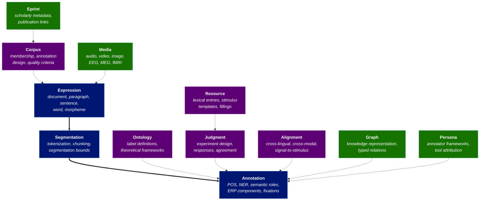

# Introduction

## What is Layers?

Layers is a set of ATProto Lexicon v1 schemas for representing, sharing, and interlinking linguistic data in a decentralized network. It defines a composable interchange format that covers three broad categories of data:

- **Linguistic annotations** across text, audio, video, and image modalities: part-of-speech tags, named entities, syntactic parses, semantic roles, discourse relations, coreference, temporal and spatial expressions, interlinear glossed text, and more. See the [Multimodal Annotation guide](./guides/multimodal-annotation.md) for how the same annotation schema works across modalities.

- **Psycholinguistic and neurolinguistic signals**: self-paced reading times, eye-tracking fixations and saccades, EEG/ERP waveforms with electrode montages, MEG sensor data with source localization, and fMRI BOLD activations with ROI definitions. See the [Psycholinguistic Data guide](./guides/psycholinguistic-data.md) for how each modality maps to Layers primitives.

- **Offline judgment and experiment data**: judgment types (acceptability, inference, similarity, preference, and others) collected via independent response instruments (ordinal scales, forced choice, categorical selection, span labeling, free text, and others), together with parameterized stimulus templates, experimental designs (Latin square, blocked, adaptive), behavioral analytics, and inter-annotator agreement reports. See the [Judgment Data guide](./guides/judgment-data.md) for the full experiment lifecycle.

Layers subsumes 15+ major annotation data models (including CoNLL, brat, ELAN, TEI, Universal Dependencies, and others) while maintaining a theory-neutral, modular architecture. All data lives in user-controlled Personal Data Servers (PDSes); Layers provides the schema and protocols for interoperability.

## Why Layers?

Linguistic and psycholinguistic data is fragmented across incompatible formats, stored in centralized repositories, and lacks a common interchange layer:

- **Fragmentation**: Each data type has its own format. Annotations use CoNLL, brat, ELAN, or TEI. Eye-tracking data uses EyeLink EDF or tab-delimited exports. EEG data uses EDF, BDF, or FIFF. Judgment data uses custom CSVs or platform-specific formats. There is no common schema for translation or composition across these.
- **Centralization**: Datasets live in centralized repositories (Linguistic Data Consortium, GitHub, institutional servers) or isolated research databases. Users have no control over data access, licensing, or portability.
- **Lock-in**: Annotations created in one tool cannot be easily imported into another. Psycholinguistic data locked in proprietary formats requires custom conversion scripts that fail on edge cases.
- **Isolation**: There is no standard way to link annotations to the experiments that produced them, relate judgments to the stimuli they were collected on, connect neural signals to the linguistic expressions that elicited them, or discover related work across these data types.

Layers solves this by:

1. **Defining shared primitives** that all data types compose from (anchors, constraints, agents, metadata, feature maps).
2. **Staying theory-neutral** by representing all linguistic labels, categories, and formalisms as data values, not schema.
3. **Using ATProto for decentralization**: all user data lives in their PDSes; records are ATProto objects that users publish and control.
4. **Providing tight integration** with publication metadata, knowledge bases (Wikidata, FrameNet, brain atlases), and existing tools (via W3C Web Annotation selectors).
5. **Supporting composition** across modalities and data types through recursive cross-referencing: annotations link to expressions, judgments link to stimuli, neural signals align to experimental events, and all of these link to the publications that describe them.

## Status

Layers is in **v0.3.0 draft** status, in active development and accepting comments and discussion. File issues or participate on GitHub: https://github.com/layers-pub/layers

## Architecture Overview

Layers is organized around a **core pipeline** of annotation layers, with **parallel tracks** for experimental and analytical workflows and **integration layers** connecting to the ATProto ecosystem and external data:

**Core pipeline** (blue): Expressions are recursive: a document contains paragraphs, which contain sentences, which contain words, which contain morphemes. Segmentation records define the ordered decomposition of a parent expression into child expressions. Annotation layers attach linguistic labels to any level of the hierarchy.

**Parallel tracks** (purple): Ontologies defines label systems and theoretical frameworks. Corpora collects expressions with annotation project design metadata (redundancy, adjudication, quality criteria). Resources provides lexical entries and stimulus templates. Judgments captures experiment definitions with four orthogonal dimensions (measure type, task type, presentation, recording). Alignment links structures across languages, modalities, and records.

**Integration layers** (green): Graphs provide typed property graphs for knowledge representation. Media stores raw signals (audio, video, EEG, fMRI). Eprint connects to scholarly metadata. Persona tracks annotator frameworks and tool attribution.

## License

Layers is licensed under [CC-BY-SA-4.0](https://creativecommons.org/licenses/by-sa/4.0/deed.en).

## Next Steps

- Read [Foundations](./foundations/index.md) for design principles, primitives, and the flexible enum pattern.
- See [Lexicon Overview](./foundations/lexicon-overview.md) for the full list of schemas and their dependency graph.
- Explore the [Guides](./guides/index.md) for in-depth coverage of cross-cutting topics:
  - [Multimodal Annotation](./guides/multimodal-annotation.md): annotation across text, audio, video, image, and paged documents.
  - [Psycholinguistic Data](./guides/psycholinguistic-data.md): self-paced reading, eye-tracking, EEG, MEG, and fMRI.
  - [Judgment Data](./guides/judgment-data.md): experiment design, stimulus pipelines, and judgment collection.
  - [Annotation Design](./guides/annotation-design.md): source method, annotator redundancy, adjudication, and quality criteria.
  - [Temporal Representation](./guides/temporal-representation.md): dates, durations, intervals, and Allen's relations.
  - [Spatial Representation](./guides/spatial-representation.md): coordinates, regions, brain atlases, and RCC-8 relations.
  - [Knowledge Grounding](./guides/knowledge-grounding.md): linking to Wikidata, FrameNet, WordNet, and typed property graphs.
